# 汇编笔记——基于王爽的汇编语言第四版

**win10不能直接使用DOS进行debug了，需要配置包内的DOSBOX和asm才能运行debug、masm、link**

## 基础知识

### 机器语言

机器语言：

> 定义：机器指令的集合

机器指令：

> 定义：机器可以正确执行的命令，是二进制数字，计算机将之转变为高低电平

### 汇编语言的产生

> 操作：寄存器BX的内容送到AX中
>
> 机器指令：1000100111011000(可以看出机器指令的不便了，抄这一段都有点困难了)
>
> 汇编指令：mov ax,bx

人使用方便了，但机器看不懂了，所以有**编译器**来把汇编译为机器码

### 汇编语言的组成

组成指令：

1. 汇编指令：机器码助记符，有对应的机器码
2. 伪指令：没有对应的机器码，由编译器执行，计算机不执行
3. 其他符号：如+、-、*、/等，由编译器识别，没有对应的机器码

### 存储器

存放指令和数据，也就是平常所说的内存，内存的作用仅次于CPU

### 指令和数据
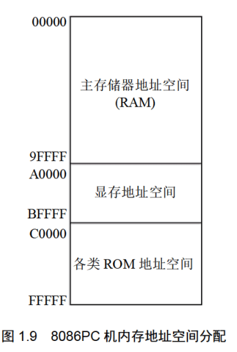

在内存或磁盘上，这两者没有区别，都是二进制数据
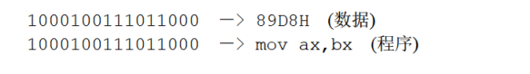

### 存储单元

从0开始编号

> 电子计算机最小信息单位——bit(比特)——一个二进制位
>
> byte(字节) = 8bit
>
> 存储单元储存——1byte

存储器以字节为最小单位

> 1B = 8b
>
> 1KB = 1024B
>
> 1MB = 1024KB
>
> 1GB = 1024MB
>
> 1TB = 1024GB

### CPU对存储器的读写

要和外部器件(芯片)进行三类交互才能进行数据读写

- 存储单元的地址(地址信息)
- 器件的选择，读或写的命令(控制信息)
- 读或写的数据(数据信息)

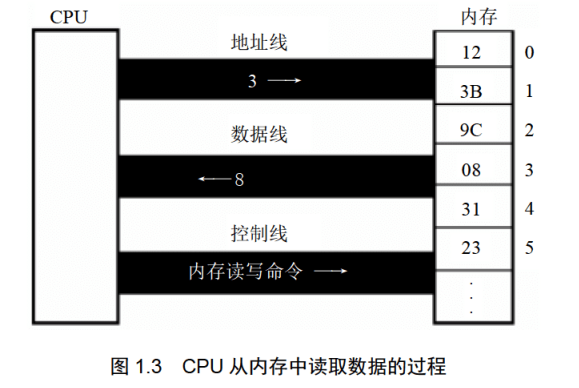

CPU传输信息靠总线==地址总线、控制总线、数据总线==

### 地址总线

地址总线能传送多少不同的信息就可以对多少储存单元进行寻址

> N根地址线 = 地址总线的宽度为N = 最多寻找2^N^个内存单元

### 数据总线

数据总线宽度决定数据传送速度

> 8根总线一次可以传1个字节(8个bit位)，16根则传两个字节

### 控制总线

不同控制线的集合，多少根控制总线，CPU就能对外部器件提供多少控制

### 检测点1

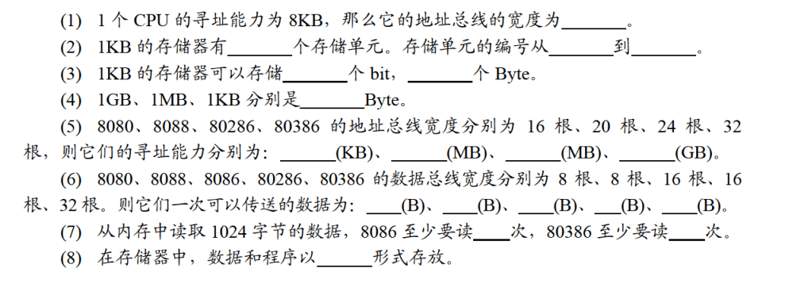

1. 13   (在没有特别说明的情况下，一个内存单元是1B大小，所以1KB需要13根地址总线来查找）
2. 1024 0 1023
3. 2^13^ 2^10^
4. 2^30^ 2^20^ 2^10^
5. 64 1 16 4(10根跨一个单位)
6. 1 1 2 2 4
7. 516 256
8. 二进制

### 内存地址空间(概述)

> eg.10根可以寻址1024内存单元，这1024个就构成CPU的内存地址空间

### 主板

每台PC机有一个主板，由CPU、存储器、外围芯片组、扩展插槽(一般插RAM内存条和各类接口卡)等，这些器件通过总线相连

### 接口卡

CPU通过总线向接口卡发送命令，接口卡根据CPU的，命令控制外设

### 各类存储器芯片

读写属性看分两类

- 随机存储器(RAM)——可读写，带点储存，关机后内容丢失
- 只读存储器(ROM)——只读，关机后内容不丢失

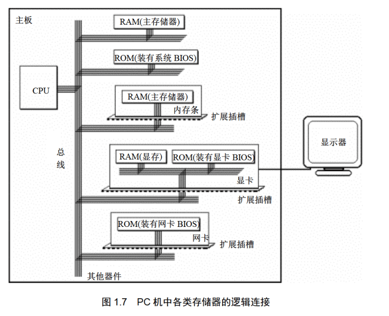

### 内存地址空间

这些储存器，物理上是独立器件，但CPU操纵它们的时候看作总的若干单元组成的逻辑存储器——==就是内存地址空间==

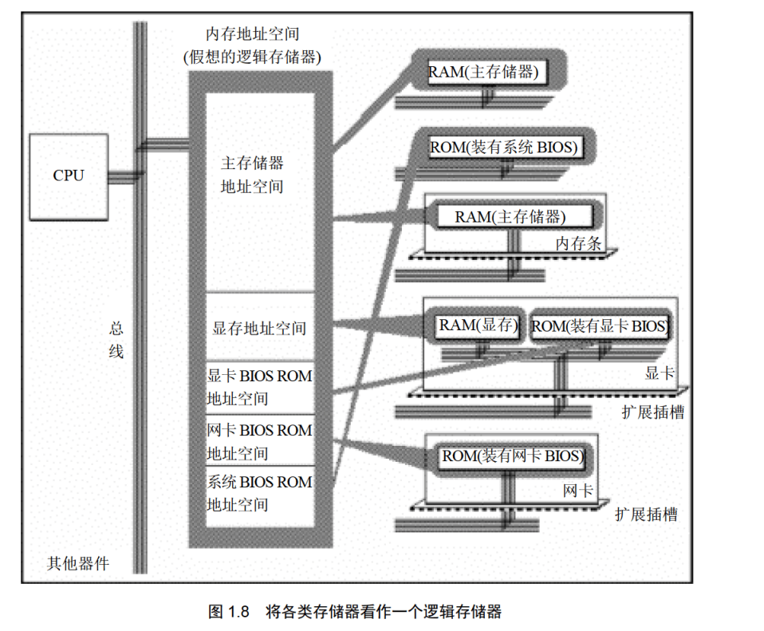

**在汇编中我们面对的就是内存地址空间**

不同计算机系统的内存地址空间分配情况是不同的


> 在上图中，0-9FFFF中读取就是主随机存储器中读取，A0000-BFFFF中写数据，就是显存中写数据，会被输出到显示器上，向C0000-FFFFF写数据无效，因为这等于向只读存储器中写内容

## 寄存器

CPU由运算器、控制器、寄存器等器件构成(靠内部总线相连，上文所讲的是外部总线)

> 运算器进行信息处理
>
> 寄存器进行信息存储
>
> 控制器控制各个器件进行工作
>
> 内部总线连接各种器件，在他们之间进行数据的传输

汇编中，主要是对寄存器用指令进行读写，来实现对CPU的控制

> 8086有14个寄存器：AX、BX、CX、DX、SI、DI、SP、BP、IP、CS、SS、DS、ES、PSW

### 通用寄存器

8086所有寄存器都是16位的，AX、BX、CX、DX是通用寄存器

> 8086上一代寄存器是8位的，为保证兼容性，这四个寄存器可分别分为两个独立使用的8位寄存器

- AX分为AH和AL
- BX分为BH和BL
- CX分为CH和CL
- DX分为DH和DL

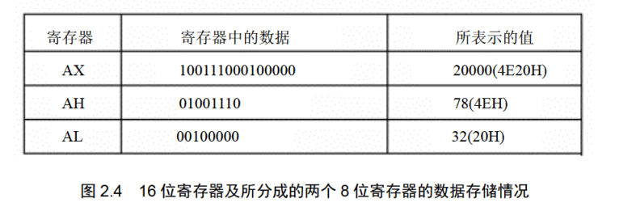
一个寄存器可以表示的数据如上图所示

### 字在寄存器中的存储

- 字节：byte，可以存在8位寄存器中
- 字：word，两个字节组成，分别为高位字节和低位字节

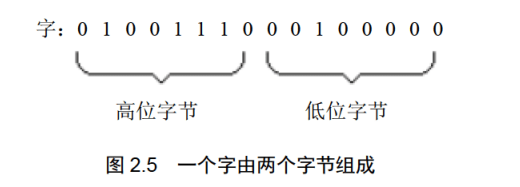

所以一个16位寄存器的数据看法不同意义不同

> 看成字型数据是20000，看成两个字节数据是78和32

数据表示方法：十进制后不加，十六进制后加H，二进制后加B

### 几条汇编指令

指令操作的两个对象位数应该是一致的

```asm
//以下指令都是错误指令
mov ax,bl
mov bh,ax
mov al,20000
add al,100H
```

### 检查点2.1

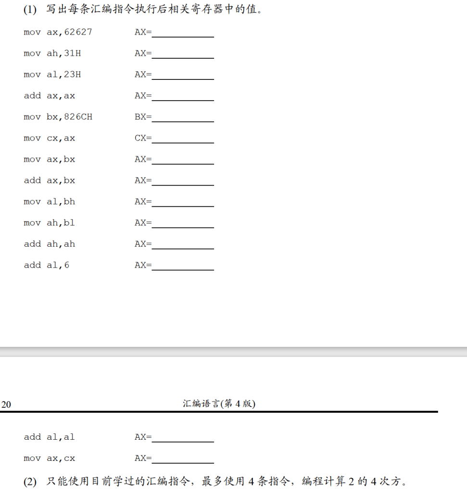

(1) F4A3H	31A3H	3123H	6246H	826CH	6246H	826CH	04D8H	0482H	6C82H	D882H	D888H	D810H	6246H

(2) mov ax,2 	 add ax,ax	 add ax,ax 	add ax,ax 

### 物理地址

每一个内存单元的唯一地址称为物理地址

### 16位结构的CPU

- 运算器一次最多可以处理16位的数据
- 寄存器最大宽度为16位
- 寄存器和运算器之间的通路为16位

### 8086CPU给出物理地址的方法

它有20根地址总线，是1M的寻址能力，而CPU是16位结构，如果地址从内部简单发出只能送出16位，也就是64KB

所以内部是用两个16位地址合成一个20位的物理地址的方法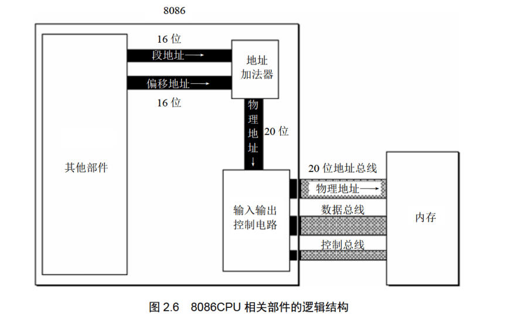

==物理地址 = 段地址×16 + 偏移地址==(×16也就是16进制左移一位，二进制左移4位)

### ”物理地址 = 段地址×16 + 偏移地址“的本质意义

本质是**基础地址+偏移地址 = 物理地址的寻址模式**的具体实现方案，只不过在8086中基础地址是段地址×16

### 段的概念

千万不能理解成内存被分为一个一个段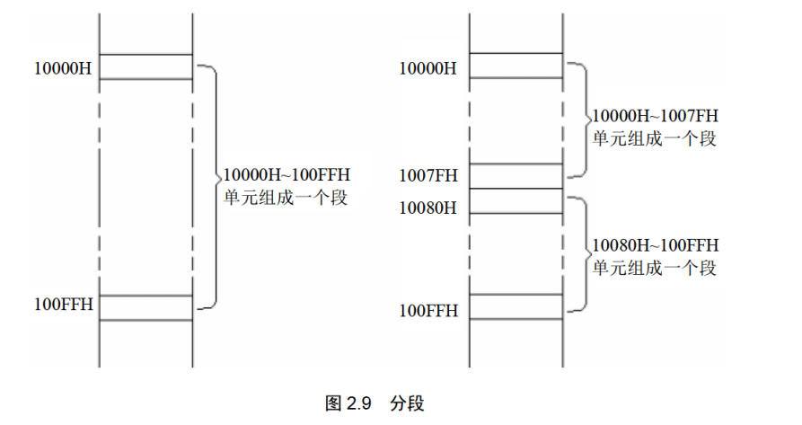

上图很直观的看出段的概念及其意义

> 左图：将10000H-100FFH看成一个段，段地址为1000H
>
> 右图：分成10000H-1007FH和10080H-100FFH两个段，段地址为1000H和1008H

很明显，段地址×16必然是16的倍数，所以段的起始地址一定是16的倍数

偏移地址为16位，所以一个段的最大长度为64KB

==补充点==

1. CPU可以用不同的段地址和偏移地址形成同一个物理地址

   > 21F60H 可以由 段地址2000H和偏移地址1F60H形成
   >
   > 也可以由段地址2100H和偏移地址0F60H形成

2. 给定段地址最多可以寻址64KB个内存单元

3. 表达存储单元的方式

   > 21F60H内存单元中，描述为2000:1F60单元中或者2000H段中的1F60H单元中

### 检测点2.2


(1) 00010H		1000FH

(2) 1001H		2000H

x < 1001H或x > 2000H时，cpu无论怎么变化也无法找到20000H

### 段寄存器

找到物理地址需要段地址，提供段地址的就是段寄存器

> 8086有4个段寄存器：CS、DS、SS、ES

### CS和IP

是8086中最关键的寄存器。CS中为M，IP中为N，8086将从M×16+N读取一条指令并执行——所以8086中任何时候CS:IP都是读的指令

读取一条指令后，IP中的值自动增加，以使CPU可以读取下一条指令，根据当前指令的长度增加(即到下一条指令，因为有些指令3字节，有些2字节等)

8086CPU的工作过程简要描述如下

> 从CS:IP指向的内存单元读取指令，读取的指令进入指令缓冲器
>
> IP = IP+所读取指令长度，从而指向下一条指令
>
> 执行指令

在8086启动或者复位后，CS和IP分别被设置为FFFFH和0000H，所以FFFF0H是开机后执行的第一条指令

此时我们可以知道CPU怎么分辨出指令了，如果一段信息被CPU执行过的话，它的内存单元必然被CS:IP指向过

### 修改CS、IP的指令

程序员可以通过改变CS、IP中的内容来控制CPU执行目标指令，能改变CS、IP的指令统称为转移指令(目前只简单介绍一个jump指令)

- jump 2AE3:3 执行后将从2AE33H处读取指令(既修改CS又修改IP)

- jump ax 执行前：ax = 1000H，CS = 2000H，IP = 0003H

  执行后：ax = 1000H，CS = 2000H，IP = 1000H，

  含义上类似：mov IP,ax(只是便于理解，并不是真有这个指令)

### 代码段

在编程中，可以用长度小于64KB的一组连续的内存单元，起始为16整数倍的内存单元来存放代码，从而定义了一个代码段

### 检测点2.3

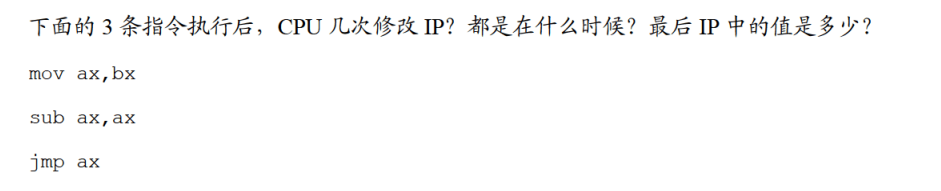

4次，上面三句的读取时，以及jump的执行时

### 实验1 查看CPU和内存，用机器指令和汇编指令编程

什么是Debug？

> DOS、Windows都提供的实模式程序调试工具，可以查看CPU各种寄存器中的内容、内存情况和在机器码级跟踪程序的运行

Debug功能

共有20多个，密切相关的如下

- R命令，查看、改变CPU寄存器的内容
- D命令、查看内存中的内容
- E命令，改写内存中的内容
- U命令，将内存中的机器指令翻译成汇编指令
- T命令，执行一条机器指令
- A命令，以汇编指令的格式在内存中写入一条机器指令

进入Debug==(win10下载DOSBOX模拟)==

1. 重启，进入DOS，此时进入的是实模式DOS
2. Windows进入，此时进入虚拟8086模式DOS

**这个实验其实就是对上方六个命令的熟悉使用**

## 寄存器(内存访问)

### 内存中字的存储

CPU用16位寄存器存储一个字，即一个字要用两个地址连续的内存单元存放

字单元：存放一个字型数据的内存单元，由两个地址连续的内存单元组成

N地址字单元：N为字单元的起始地址，如：某字单元由2、3两个内存单元组成，起始是2，所以是2地址字单元

### DS和[address]

```asm
mov al,[0]
```

mov的第二个参数是内存单元地址，但上方中[0]表示的只是偏移地址，此时我们需要明确，8086自动取ds中的数据为内存单元的段地址

```asm
mov bx,1000H
mov ds,bx
```

DS不允许(原因不需要深究)直接将数据送入段寄存器的操作，所以需要借助另一个寄存器来中转，最后就能找到对应的内存单元了——10000H

### 字的传送

8086是16位结构，直接mov送就可以了

```asm
mov ax,[0]  //此处[0]看不懂见上一点
mov [0],cx
```

### mov、add、sub指令

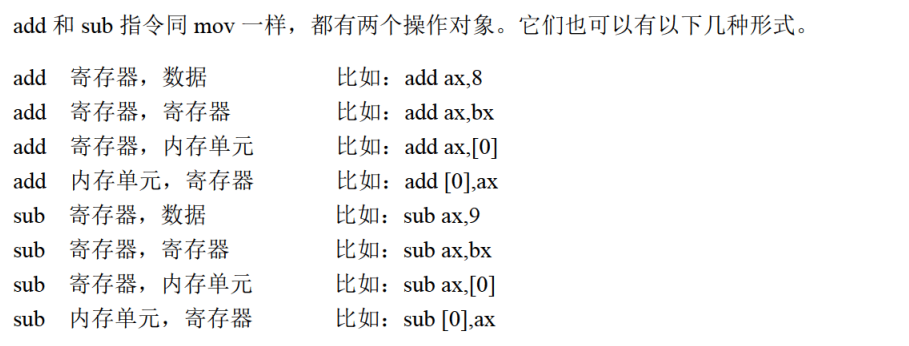

### 数据段

可以说就是用来存数据的段

### 检测点3.1

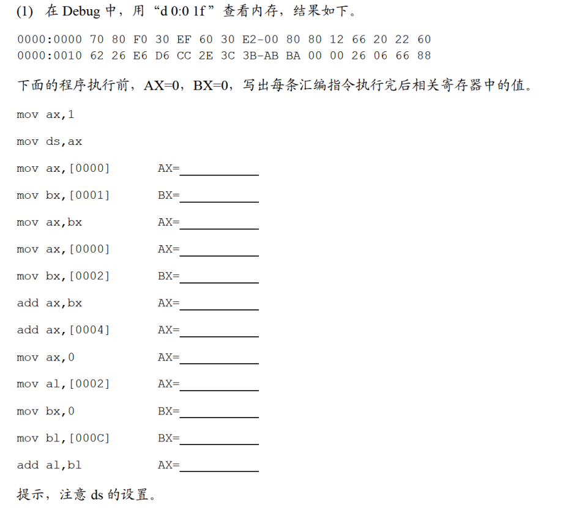

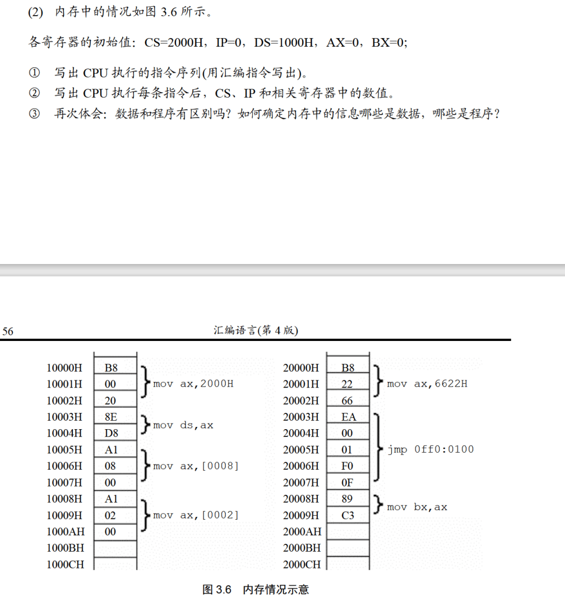

(1) AX=2662H、BX=E626H、AX=E626H、AX=2662H、BX=D6E6H、AX=FD48H、AX=2C14H、AX=0000H、AX=00E6H、BX=0000H、BX=0026H、AX=000CH

(2) mov ax,6622H 
CS=2000H IP=3 DS=1000H AX=6622H BX=0000H
jmp 0ff0:0100 
CS=0ff0H IP=0100 DS=1000H AX=6622H BX=0000H 
mov ax,2000H 
CS=0ff0H IP=0103 DS=1000H AX=2000H BX=0000H
mov ds,ax 
CS=0ff0H IP=0105 DS=2000H AX=2000H BX=0000H
mov ax,[0008] 
CS=0ff0H IP=0108 DS=2000H AX=C389H BX=0000H
mov ax,[0002] 
CS=0ff0H IP=010B DS=2000H AX=EA66H BX=0000H

**在区别程序和数据时，关键是看段地址，如果段地址是ds**
**段，说明该内存存放的是数据，如果段地址是cs段，说明该内存**
**存放的是指令。**

### 栈

很熟悉了，就是先进后出，标记一直指着最上面

### CPU提供的栈机制

提供push和pop指令，8086的出入栈以字为单位

> 8086有段寄存器SS和寄存器SP
>
> ==任意时刻，SS:SP指向栈顶元素==

入栈时栈顶从高地址向低地址方向改变，即push时SP = SP - 2，pop时SP = SP + 2

特别注意，pop时只是移动SP，并没有将pop出的内存单元归零，之后才可能被覆盖

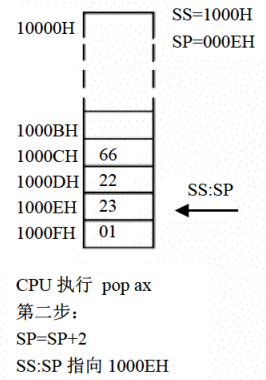

### 栈顶超界问题

你认为8086会提供给你寄存器来判断是否超界？天真了，只能程序员自己注意把控，以可能会用到的最大栈空间来安排栈的大小

### push、pop指令

以下三个都是后接部分入栈或者出栈到后接部分，真正的数据前面说了，从SS:SP拿

> push/pop 寄存器
>
> push/pop 段寄存器
>
> push/pop 内存单元

**补充：**SS:SP可以和DS的使用联系使用，都是提供了一个找内存单元的简便方法

### 栈段

额，只要知道段的概念，这些都很简单，栈段就是被当作栈使用的段

==段的总结，总结的相当好==

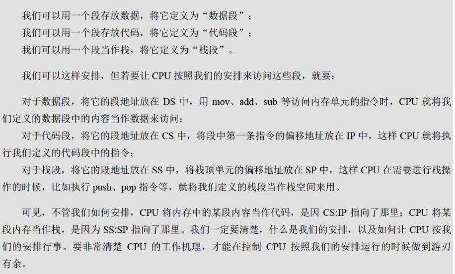

### 检测点3.2

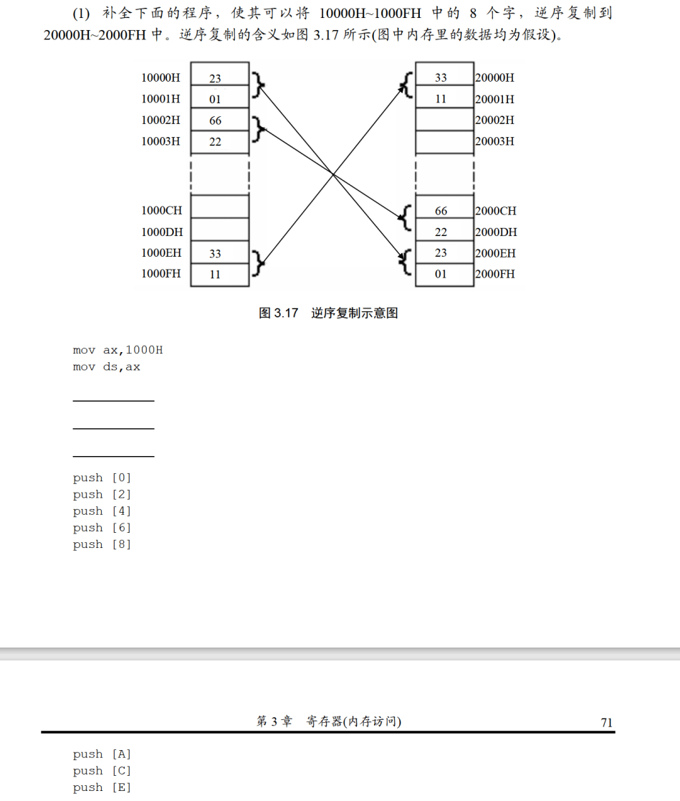

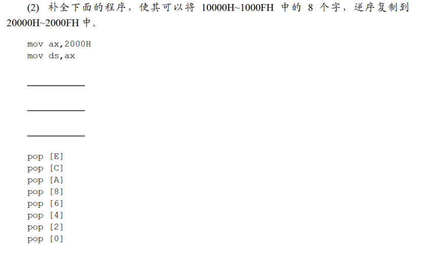

(1) mov ax,2000、mov ss,ax、mov sp,0010

(2) mov ax,1000、mov ss,ax、mov sp,0000 

### 实验2 用机器指令和汇编指令编程

1、Debug的使用(段寄存器相关)

也是那六个字母指令的使用

2、实验任务(较为简单)

## 第一个程序

之前都是铺垫，只在Debug中执行，接下来是完整的汇编语言程序，用编译链接程序将它们变为可执行文件

### 一个源程序从写出到执行的过程

1. 使用文本编辑器编写汇编源程序

2. 对源程序进行编译连接

   > 使用汇编语言程序对源程序进行编译，产生目标文件，再对目标文件进行连接，生成可执行文件(有下面两部分)

   - 程序和数据
   - 相关的描述信息

3. 执行可执行文件

### 源程序

```asm
assume cs:codesg

codesg segment

       mov ax,0123H
       mov bx,0456H
       add ax,bx
       add ax,ax
       
       mov ax,4c00H
       int 21H
       
codesg ends

end
```

程序说明

1.伪指令

汇编包含两种指令：汇编指令和伪指令(只是编译器执行)

- XXX segment / XXX ends(成对使用，必须用到)

  用来定义一个段

- end

  区分好ends，end表示整个汇编程序结束

- assume

  “假设”，没必要深入了解，编程时记得用它将特定用途和相关段寄存器关联起来就行，比如这段代码就定义了一个名为codseg的段和cs联系起来

2.源程序中的“程序”

源程序：源程序中所有内容

程序：最终由计算机执行、处理的指令或数据

3.标号

如上面的codesg，这个段的名称最终会被编译、连接程序处理为一个段的段地址

4.程序的结构

5.程序返回

如mov ax,4c00H  int 21H就是用于将CPU的控制权交给使它运行的其他程序

6.语法错误和逻辑错误

### 编译源程序

写一个asm格式的程序文件

### 编译

正确路径语法下输入(此部分找不到再去网上了解) masm mul.asm

 三个选项没有什么要更改的话(分别对应obj、lst、crf文件)，三个enter一按就编译出了obj文件

### 连接

正确路径语法下输入(此部分找不到再去网上了解) link mul.obj

 三个选项没有什么要更改的话，三个enter一按就编译出了exe文件

简单了解以下连接的作用==(其实这些edit、debug、masm、link都不是我们关注的重点，我们学汇编是想直接和机器打交道，但是又不想写机器码才用汇编代码然后借助这些工具翻译一下我们的话)==

> 源程序很大时，可以分为多个源程序文件来编译
>
> 调用了某个库文件的子程序，需要将库和该程序的obj相连接
>
> 目标程序有些内容可能不能直接用来生成可执行文件

### 以简化的方式进行编译和连接

前面介绍了使用masm和link进行编译连接，输入命令的时候加分号就会忽略中间文件的生成(加分号相当于敲三次回车)

### exe的执行

直接执行没有结果是因为我们没有像显示器输出信息，其实是在寄存器中执行了相关操作的，之后写的程序会有能看到的

### 谁将可执行文件中的程序装载进入内存并使它运行？

程序P1若要运行，必须有一个正在运行的程序P2，将P1载入内存，P1运行完后将CPU控制权交还给使它运行的P2
**操作系统的外壳：**

> 通常操作系统都需要提供shell程序，这个程序用来操作计算机系统工作，DOS中是command.com作为shell

问：有程序将mul.exe加入内存，运行结束后返回哪里？

执行mul.exe时，command正在运行，将mul.exe载入，然后设置CS:IP，mul.exe运行结束后返回给command

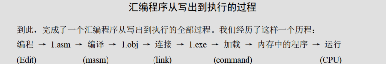

### 程序执行过程的跟踪

用debug mul.exe指令

> dos里有PSP用于和程序进行通信——占256字节，所以程序起始地址比CS:IP位置少10H:0	

> 按t执行下一步，最后的int处按p执行(暂时不知道为什么)，q退出debug返回command

### 实验3 编程、编译、连接、跟踪

就是edit、masm、link、debug的使用

## [BX]和loop指令

1.[bx]和内存单元的描述

> 段地址在ds中
>
> mov ax,[0]时内存单元就是两个字节，mov al,[0]就是一个字节
>
> 所以，mov ax,[bx]，mov al,[bx]也类似，只不过偏移地址在bx中

2.loop

> 循环

3.我们定义的描述性的符号："()"

> 为了描述简介引入的，(ax)表示ax中的内容，(al)表示al中的内容，(20000H)表示内存20000H单元的内容，((ds)*16+(bx))表示段地址为ds，偏移为bx的单元内容，只有这四种表示是正确的用法

4.约定符号idata表示常量

### [BX]

就是bx存放偏移地址

### Loop指令

执行loop时进行两步操作：

- (cx) =(cx) - 1;
- 判断cx中的值，不为0就转到标号处执行

```asm
;下面代码用于算2的11次方
assume cs:code
code segment
	mov ax,2
	mov cx,11
s:  add ax,ax
	loop s
	mov ax,4c00h
	int 21h
code ends
end
```

### 在debug中跟踪用loop指令实现的循环程序

问：ffff:0006单元中的数乘以3

dx中应该是能储存得下的

```asm
assume cs:code
code segment
	mov ax,0ffffh	;此处要注意，为什么要加0，因为汇编源程序数据不能以字母开头
	mov ds,ax
	mov bx,6
	mov ax,[bx]
	mov ah,0
	mov dx,0
	mov cx,3
s:  add dx,ax
	loop s
	mov ax,4c00h
	int 21h
code ends
end
```

对上一段代码进行debug，然后发现loop确实循环了

#### Debug和汇编编译器masm对指令的不同处理

对比

- debug中，[idata]的解释为"[idata]"，一个内存单元
- 编译器中，[idata]的解释为”idata“，偏移地址(编译器中需要借助bx才能直接使用[])

> 也就是说在编译器中，mov al,[0]表示将0送人al中(与mov al,0相同含义)，mov al,ds:[0]才是把对应内存单元的数据送入al中，mov al,[bx]和mov al,ds:[bx]都是对应内存单元

==总结就是：编译器中要么显示给出段地址，要么用bx==

### loop和[bx]的联合应用

```asm
assume cs:code
code segment
	mov ax,0ffffh
	mov ds,ax
	mov bx,0
	mov dx,0
	mov cx,12;以上和普通写代码一样，先初始化好
s:  mov al,[bx]
	mov ah,0
	add dx,ax
	inc bx
	loop s
	
	mov ax,4c00h
	int 21h
code ends
end
```

以上可以看出bx其实在循环里使用还是很好的，当作变量用

### 段前缀

显式指明内存单元的段地址(ds:、cs:、ss:、es:等)

### 一段安全的空间

随意向一段内存空间写入内容是很危险的，假如在实模式下是会出现死机等情况的，我们是在操作系统上工作，所以我们应该使用操作系统给我们分配的空间(下一章学习)

但我们也不能被操作系统束缚住，我们学汇编还是偏向自由直接汇编操作硬件，学操作系统的话则相反

但还是为了避免出错，我们一般使用0:200-0:2ff单元的内容，这里还是比较安全的

### 实验4 [bx]和loop的使用

(1) 内存0:200-0:23F传送数据0-63(限定九条指令)

```asm
assume cs:code
code segment
	mov ax,20h
	mov ds,ax

	mov cx,64
	mov al,0
s:  mov [al],al;不能用bx，要用al因为bx是16位寄存器
	inc al
	loop s
	
	mov ax,4c00h
	int 21h
code ends
end
```

(2)补全下面的程序，其功能是将`mov ax,4c00`之前的指令复制到内存0:200处,补全程序,上机调试,跟踪运行结果

1. 复制了什么?从哪里到哪里?
2. 复制的是什么?有多少字节,你如何知道要复制的字节数量?

```asm
assume cs:code
code segment

    mov ax,___
    mov ds,ax;ds的地址为ax
    mov ax,0020h
    mov es,ax;es是20h
    mov bx,0
    mov cx,___
    
s:	mov al,[bx];将ds;bx的值赋值给al
    mov es:[bx],al;将al的值赋值给es[bx]
    inc bx;bx++
    loop s

    mov ax,4c00h
    int 21h

code ends
end
```

程序开始是CS:IP所以第一空应该填cs(程序开始处)，然后就是程序占多少字节，mov 寄存器,立即数型占3字节，mov 寄存器,寄存器型的指令占2字节，inc占1字节，loop占2字节(但是只有22字节，答案是23字节，因为es:有1字节)——所以==23字节(17h)==

第一空：cs

第二空：17h

## 包含多个段的程序

前面的程序只找到一个地方写代码段，并且256字节还不是很够，那么数据存哪里呢，程序取得所需空间的方法有两种：一是加**载程序的时候分配**，二是执行中申请(不讨论)

### 在代码段中使用数据

情景：8个数据求和

直接求和当然可以，但是我们一般还是想先把它们存到一组连续的空间中，然后循环求和

```asm
assume cs:code;这段代码是有错误的，只是用于讲解
code segment
	dw 0123h,0456h,0789h,0abch,0defh,0fedh,0cbah,0987h
	mov bx,0
	mov ax,0
	mov cx,8
s:  add ax,cs:[bx]
	add bx,2
	loop s
	
	mov ax,4c00h
	int 21h
	
code ends
end
```

代码详解：

1. dw的含义是定义字型数据，即define word

2. 为什么用cs呢，因为它们定义在程序代码段的最开始，所以偏移是0

3. 字型数据，所以bx每次加2

4. debug发现确实前16个字节存的是数据
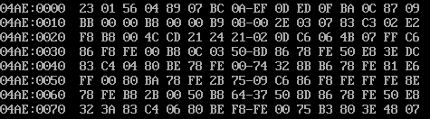

   真正的指令存在16字节后

   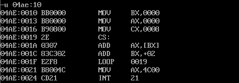

==由上图的规律的话，我们应该提前将ip往后推，这样才能运行到真正的指令==

==但是这样我们必须用debug来执行程序，编译连接后可能会出现问题，所以接下来学习编译器中应该怎么写==

```asm
assume cs:code
code segment
	dw 0123h,0456h,0789h,0abch,0defh,0fedh,0cbah,0987h
start:   mov bx,0;区别处
		mov ax,0
		mov cx,8
s:  	add ax,cs:[bx]
		add bx,2
		loop s
	
		mov ax,4c00h
		int 21h
	
code ends
end start;区别处
```

end其实不止通知编译器结束程序，还通知编译器程序的入口(这里是start)

编译连接中是如何设置CS:IP的呢？

这一点是**由可执行文件中的描述信息指明的**，可执行文件中可不只有程序，end start指明了程序入口，被转化为了一个入口地址，被存储在可执行文件的描述信息里

```asm
assume cs:code;以后的程序基本格式
code segment
		.
		.
		.
		数据
		.
		.
		.
start:
		.
		.
		.
		代码
		.
		.
		.
code ends
end start
```

### 在代码中使用栈

情景实现数据逆序存放

类比上一节学习，直接给出代码了

```asm
assume cs:codesg
codesg segment
	dw 0123h,0456h,0789h,0abch,0defh,0fedh,0cbah,0987h
	dw 0,0,0,0,0,0,0,0,0,0,0,0,0,0,0,0;定义16个字型数据，开辟的空间后续可以当作栈使用
start: 	mov ax,cs
		mov ss,ax
		mov sp,30h;设置栈顶ss:sp指向cs:30,可以思考一下为什么是30H
		
		mov bx,0
		mov cx,8
	s:	push cs:[bx]
		add bx,2
		loop s
		
		mov bx,0
		mov cx,8
	s0:	pop cs:[bx]
		add bx,2
		loop s0
		
		mov ax,4c00h
		int 21h
codesg ends
end start
```

### 检测点6.1

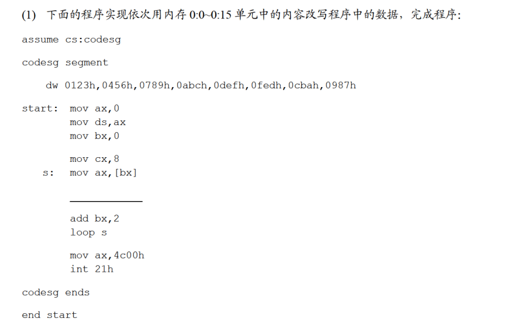

(1) mov cs:[bx],ax

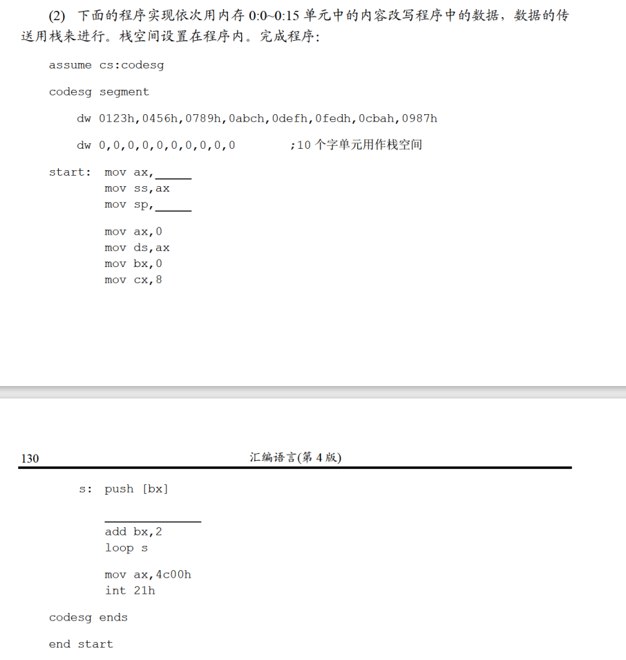

(2) cs 24h pop cs:[bx]

### 将数据、代码、栈放入不同的段

前面的代码把这三者都放入了同一个段中，引发了一些问题

- 放一个段里显得混乱
- 如果三者合起来超过64KB想放都放不了

直接代码演示吧

```asm
assume cs:code,ds:data,ss:stack
data segment
	dw 0123h,0456h,0789h,0abch,0defh,0fedh,0cbah,0987h
data ends
stack segment
	dw 0,0,0,0,0,0,0,0,0,0,0,0,0,0,0,0
stack ends
code segment
start:	mov ax,stack
		mov ss,ax
		mov sp,20h;设置栈顶ss:sp指向stack:20
		
		mov ax,data
		mov ds,ax
		mov bx,0
		
		mov cx,8
	s:	push [bx]
		add bx,2
		loop s
		
		mov bx,0
		mov cx,8
	s0:	pop [bx]
		add bx,2
		loop s0
		
		mov ax,4c00h
		int 21h
code ends
end start
```

1. 定义多个段的方法
2. 对段地址的引用——段名相当于段地址，所以用mov ax,stack
3. 代码段、数据段、栈段完全是我们安排

### 实验5 编写、调试具有多个段的程序

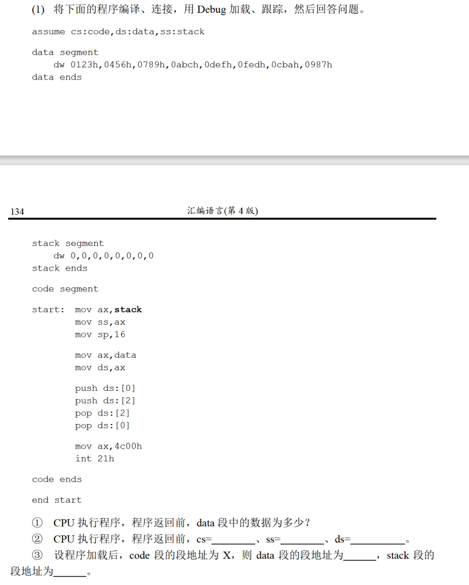

==(1) ① 23 01 56 04 89 07 BC 0A-EF 0D ED 0F BA 0C 87 09==

==②cs=_076C_、ss=_076B_、ds=_076A _==

==③ X-2 X-1==

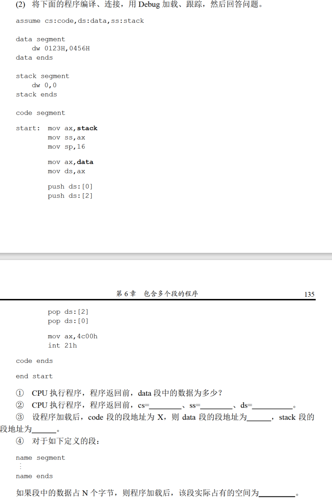

==(2) ①23 01 56 04 00 00 00 00-00 00 00 00 00 00 00 00==

==② cs=_076C_、ss=_076B_、ds=_076A_==

==③ X-2 X-1==

==④ ⌈N/16⌉*16==(因为小于16字节部分会设为0)

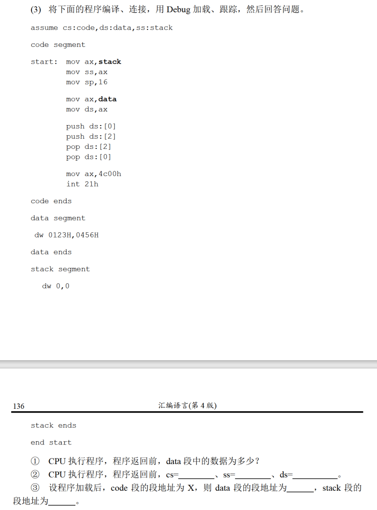

==(3) 类似，略==

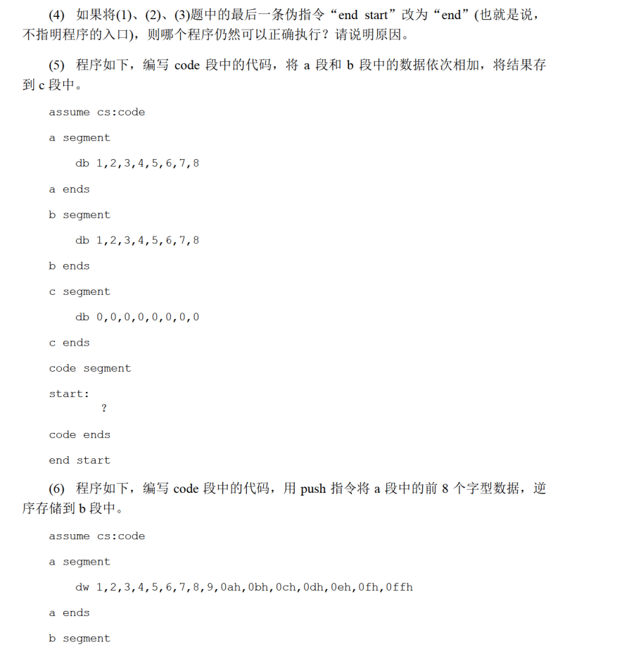

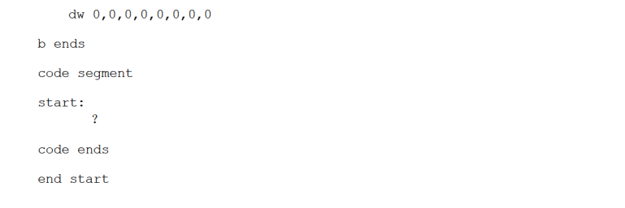

==(4) 没有设定start，则CS:IP指向首地址 很明显只有(3)能正确运行==

(5)

```asm
assume cs:code

a segment
	db 1,2,3,4,5,6,7,8
a ends

b segment
	db 1,2,3,4,5,6,7,8
b ends

c segment
	db 0,0,0,0,0,0,0,0
c ends

code segment

start:
	mov ax,a
	mov ds,ax

	mov bx,0
	mov cx,8
  s:
  	mov al,ds:[bx]
  	add al,ds:[bx+16]
  	mov ds:[bx+32],al
  	inc bx
  	loop s

  	mov ax,4c00h
  	int 21h	

code ends

end start			
```

(6)

```asm
assume cs:code

a segment
	dw 1,2,3,4,5,6,7,8,9,0ah,0bh,0ch,0dh,0eh,0fh,0ffh
a ends

b segment
	dw 0,0,0,0,0,0,0,0
b ends

code segment

start:
	mov ax,a
	mov ds,ax
	mov ax,b
	mov ss,ax
	mov sp,16

	sub bx,bx
	mov cx,8
  s:
  	push ds:[bx]
  	add bx,2
  	loop s

  	mov ax,4c00h
  	int 21h	

code ends

end start		
```

## 更灵活的定位内存地址的方法

前面我们都是[0]，[bx]的方法访问内存的指令，本章我们学习一些更灵活的定位内存地址的方法

### and和or指令

1.and指令：逻辑与指令，按位进与计算

> 可以用来将对应位设为0，比如 and al,10111111B就是将第六位设为0

2.or指令，逻辑与指令，按位进或计算

> 可以用来将对应位设为0，比如 and al,10111111B就是将第六位设为1

### 关于ASCII码

所有信息都是二进制，但我们更能看懂“desk”这种信息，那我们就需要一套让计算机知道的编码和解码规则

其中一种方案就是ACSII编码，如‘a’ 是61H

### 以字符形式给出的数据

在汇编程序中'......'方式指明数据是以字符形式给出的

```asm
assume cs:code,ds:data
data segment
 db 'unIX';
 db 'foRK'
data ends
code segment
 start: mov al,'a'
        mov bl,'b'
        int 21h
code ends
end start
```

> db后面跟的是字节型数据，这句相当于db 75H,6EH,49H,58H

### 大小写转换的问题

情景：数据段中，将第一个字符串小写变大写，第二个字符串大写变小写

思考，由规律可以得到，大小写的ASCII码相差20H，第一想法肯定是先判断出是大写还是小写，然后做对应的加减20H，但我们**没学判断**，==有时候转换思维比死磕重要==，其实大小写的二进制码只有第五位不一样，很明显可以用我们学过的and和or来解决

```asm
assume cs:codesg,ds:datasg
datasg segment
 db 'BaSiC'
 db 'iNfOrMaTiOn'
datasg ends
codesg segment
 start: mov ax,datasg
 		mov ds,ax
 		mov bx,0
 		
 		mov cx,5
 	s:	mov al,[bx]
 		and al,11011111B
 		mov [bx],al
 		inc bx
 		loop s
 		
 		mov cx,11
 	s0:	mov al,[bx]
 		or al,00100000b
 		mov [bx],al
 		inc bx
 		loop s0
 		
 		mov ax,4c00h
 		int 21h
 codesg ends
 end start
```

### [bx + idata]

[bx+idata]是一个内存单元(bx)+idata是它的偏移地址

> mov ax,[200+bx]    相当于   mov ax,200[bx]

### 用[bx+idata]的方式进行数组的处理

比如上面的大小写转换实验我们可以这样写了(假设两个字符串一样长)

```asm
assume cs:codesg,ds:datasg
datasg segment
 db 'BaSiC'
 db 'iNfOrMaTiOn'
datasg ends3
codesg segment
 start: mov ax,datasg
 		mov ds,ax
 		mov bx,0
 		
 		mov cx,5
 	s:	mov al,0[bx]
 		and al,11011111B
 		mov 0[bx],al
 		mov al,5[bx]
 		or al,00100000b
 		mov 5[bx],al
 		loop s
 		
 		mov ax,4c00h
 		int 21h
 codesg ends
 end start
```

### SI和DI

功能与bx相近，但不能分成两个八位寄存器

### [bx+si]和[bx+di]

[bx+si]的偏移地址是(bx)+(si)

```asm
mov ax,[bx][si] 相当于mov ax,[bx + si] 
```

### [bx+si+idata]和[bx+di+idata]

理解类似

```asm
mov ax,[bx+200+si]
mov ax,[200+bx+si]
mov ax,200[bx][si]
mov ax,[bx].200[si]
mov ax,[bx][si].200
```

### 不同的寻址方式的灵活应用

越多变量肯定越灵活，相当于可以更简单的处理多维度的问题

==补充：多层循环的时候，可以先把cx的值push，再在内层循环的末尾pop出来==

### 实验6 实践课程中的程序

将datasg段中的每个单词的前4个字母改成大写字母

```asm
assume cs:codesg,ss:stacksg,ds:datasg

stacksg segment
	dw 0,0,0,0,0,0,0,0
stacksg ends

datasg segment
	db '1. display      '
	db '2. brows        '
	db '3. replace      '
	db '4. modify       '
datasg ends

codesg segment

start:
	mov ax,stacksg
	mov ss,ax
	mov sp,16
	mov ax,datasg
	mov ds,ax
	mov bx,0

	mov cx,4
 s0:
 	push cx
 	mov si,3
 	mov cx,4
  s:
  	mov al,[bx+si]
  	and al,11011111b
  	mov [bx+si],al
  	inc si
  	loop s

  	add bx,16
  	pop cx
  	loop s0

  	mov ax,4c00H
  	int 21H

codesg ends

end start			
```

## 数据处理的两个基本问题

1. 处理的数据在什么地方？
2. 要处理的数据有多长？

### bx、si、di和bp

1. 只有这4个可以用[...]来进行内存单元的寻址
2. 在[...]中，这4个可以单个出现或者4种组合出现，但不能只si和di组合
3. 只要在[...]中使用寄存器bp，而指令没有显性给出段地址，默认段地址在ss中

### 机器指令处理的数据在什么地方

处理分三类：读取、写入、运算

机器指令只关心==指令执行前一刻它要处理的数据的位置==

### 汇编语言中数据位置的表达

三个表示方法：

1. 立即数

   > 1、2000h、00010000b、'a'

2. 寄存器

   > bx、ax、ds等

3. 段地址和偏移地址

   > [0]、[di]、[bp+si+8]等

### 寻址方式

核心就是给定偏移地址，前面赘述过多了，不再啰嗦

### 指令要处理的数据有多长

1. 通过寄存器名指明要处理的数据的尺寸
2. 用操作符X ptr指明内存单元的长度 X可以是word或byte
3. 其他，比如push 就不需要指明，因为push只进行字操作

### div指令

div是除法指令，注意点是：

1. 除数：有8位和16位，在一个reg或这内存单元中

2. 被除数，默认放在ax或ds和ax中

   > 如果除数8位，被除数16位，在ax中存放
   >
   > 如果除数16位，被除数32位，dx存放高16位，ax存放低16位

3. 结果：除数8位，al存商，ah存余数；如果除数16位，ax存商，dx存余数

   > div byte ptr ds:[0] 含义
   >
   > (al) = (ax)/((ds)*16 + 0)的商
   >
   > (al) = (ax)/((ds)*16 + 0)的余数
   >
   > div word ptr es:[0] 含义
   >
   > (ax) = [(dx)* 10000H + (ax)] /((es))*16的商
   >
   > (dx) = [(dx)* 10000H + (ax)] /((es))*16的余数

### 伪指令dd

db——定义字节型数据

dw——定义字型数据

dd——定义dword(双字型数据)

练习：用div计算data中第一个数据除以第二个数据后的结果，商存在第三个数据的存储单元中

```asm
data segment
	dd 100001
	dw 100
	dw 0
data ends
```

程序段中应该是

```asm
mov ax,data
mov ds,ax
mov ax,ds:[0]
mov dx,ds:[2]
div word ptr ds:[4]
mov ds:[6],ax
```

### dup

是一个操作符，由编译器识别处理，和db、dw、dd配合使用，用来重复数据

> db 3 dup (0) —— 定义了3个字节都是0
>
> db 3 dup (0,1,2) —— 定义9个字节，0、1、2、0、1、2、0、1、2

### 实验7 寻址方式在结构化数据访问中的应用

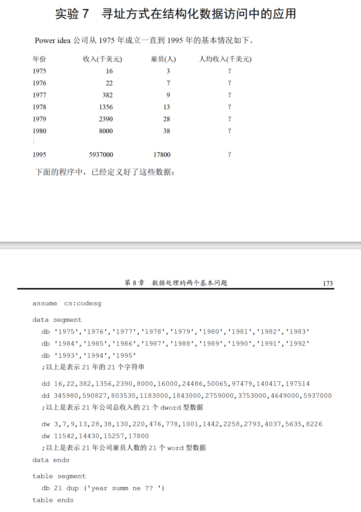

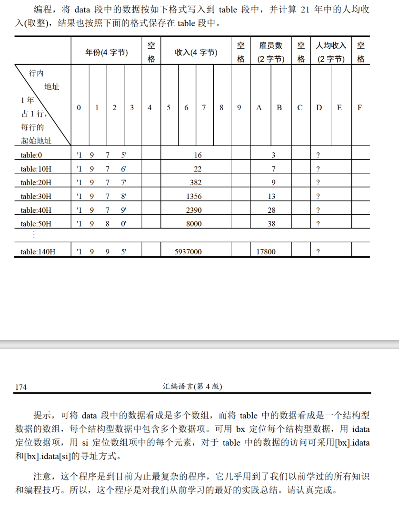

这是迄今为止最复杂的汇编程序，用的了几乎所有所学知识

```asm
assume cs:codesg,ds:table,es:data
data segment
  db '1975', '1976', '1977', '1978', '1979', '1980', '1981'
  db '1982', '1983', '1984', '1985', '1986', '1987', '1988'
  db '1989', '1990', '1991', '1992', '1993', '1994', '1995'

  dd 16, 22, 382, 1356, 2390, 8000, 16000, 24486, 50065, 97479
  dd 140417, 197514, 345980, 590827, 803530, 1183000, 1843000
  dd 2759000, 3753000, 4649000, 5937000

  dw 3, 7, 9, 13, 28, 38, 130, 220, 476, 778, 1001, 1442, 2258
  dw 2793, 4037, 5635, 8226, 11542, 14430, 15257, 17800
data ends

table segment
  db 21 dup ('year summ ne ?? ')
table ends

codesg segment
	start: mov ax,data
		mov es,ax
		
		mov ax,table
		mov ds,ax
		
		mov bx,0
		mov si,0
		mov di,168
		
		mov cx,21
	s:	mov ax,es:[si]	;存年份
		mov [bx].0h[0]
		mov ax,es:[si+2]
		mov [bx].0h[2],ax
		
		mov ax,es:[si+84]   ; 存收入
         mov [bx].5[0],ax  
         mov ax,es:[si+86]   
         mov [bx].5[2],ax
		
		mov ax,es:[di]		;存雇员人数
		mov [bx].10[0],ax
		
		mov ax,es:[si+84]
         mov dx,es:[si+86]
         div word ptr es:[di]  ;因为除数被除数都在内存中，要指明除数的长度
         mov [bx].13[0],ax
          
         add bx,10h 
         add si,4
         add di,2
         loop s
         
         mov ax,4c00h          ; 别忘了
         int 21h
codesg ends
end start
```

## 转移指令的原理

==可以修改IP，或同时修改CS和IP的指令统称为转移指令==

转移行为有两大类

- 段内转移—— 只修改IP，如 jmp ax
- 段间转移—— 修改CS和IP， 如 jmp 1000:0

段内转移又分为

- 短转移 —— IP修改范围是-128 - 127
- 近转移 —— IP修改范围是-32768 - 32767

8086的转移指令分为

- 无条件转移指令(jmp)
- 条件转移指令
- 循环指令(loop)
- 过程
- 中断

### 操作符offset

功能：由编译器处理，取得标号的偏移地址

### jmp指令

需要给出两种信息：	==下面详细讲解==

- 转移的目的地址
- 转移的距离

### 依据位移进行转移的jmp指令

> jmp short 标号(转到标号处执行指令)

这个汇编代码debug的时候会发现，汇编对应的机器码，居然不含有目标地址

==其实是因为CPU在执行jmp指令的时候并不需要转移的目的地址，只包含了转移的位移==

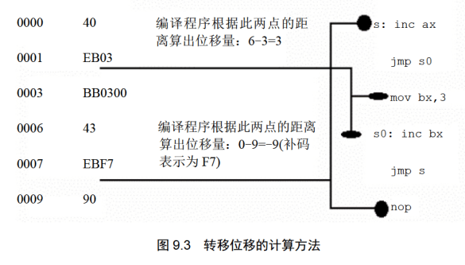

> jmp short 标号 的功能是 IP = IP + 8位位移(用补码表示)
>
> **8位位移 =  标号处的地址 - jmp指令后的第一个字节地址**
>
> jmp near 标号类似，只不过全改为16位位移

### 转移的目的地址在指令中的jmp指令

> jmp far ptr 标号 段间转移

它的底层机器码是包含转移的目的地址的

### 转移地址在寄存器中的jmp指令

> jmp 16位reg  功能： (IP) = (16位reg) 用寄存器修改IP

### 转移地址在内存中的jmp指令

两种格式；

- jmp word ptr 内存单元地址(段内转移)
- jmp dword ptr 内存单元地址(段间转移) (CS) = (内存单元地址+2) (IP) = (内存单元地址)

### 检测点9.1

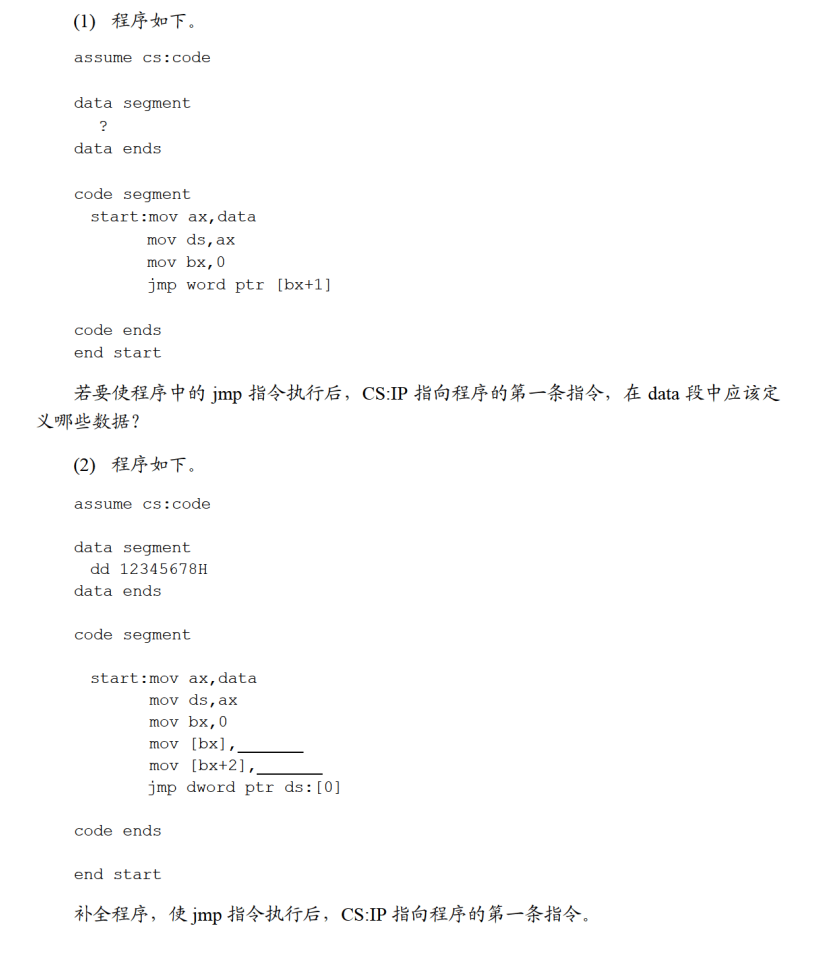

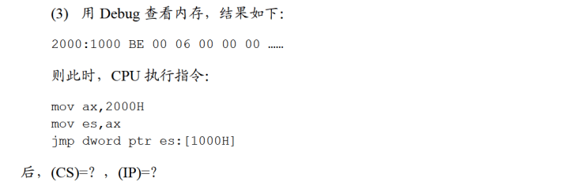

(1) db 0,0,0,0

(2) 0,cs

(3)  0006H,00BEH

### jcxz指令

有条件转移指令(都是短转移)，对应机器码中不包含目的地址

> jcxz 标号  功能相当于(if((cx) == 0) jmp short 标号 (用c语言的样子只是为了更好的解释)

### 检测点9.2

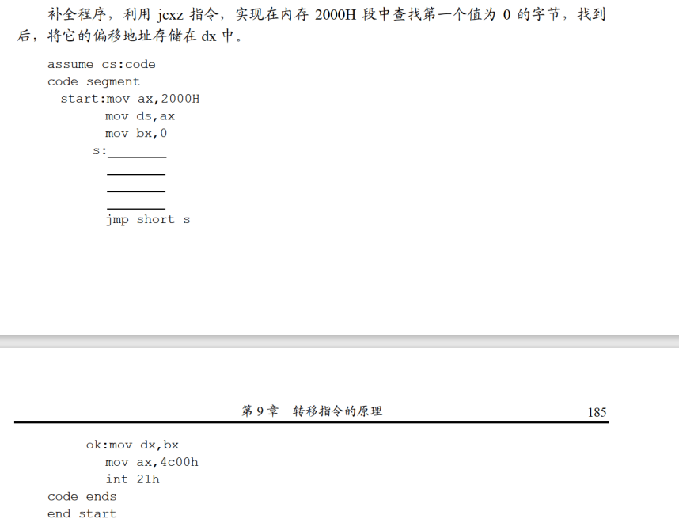

(1) mov ch,0	mov cl,[bx]	jcxz ok inc bx

### loop指令

短转移，cx等于0的时候跳出循环

### 检测点9.3

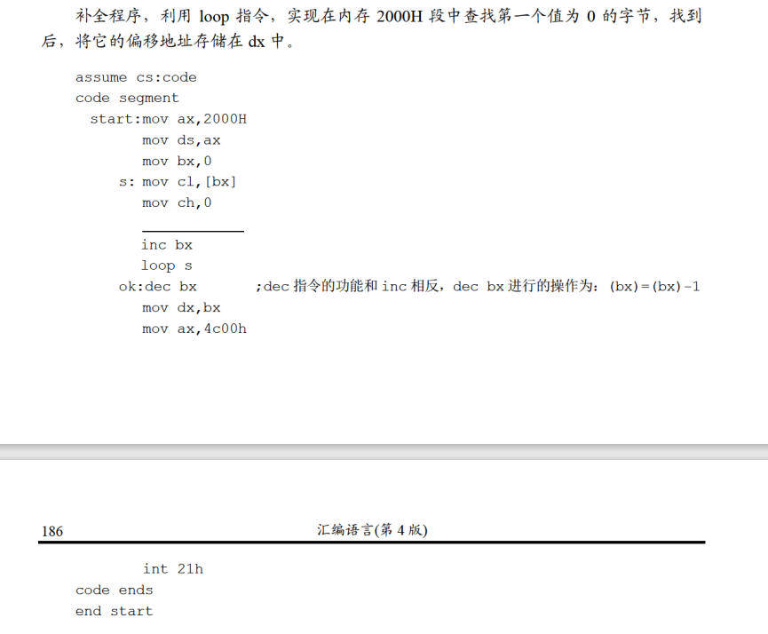

(1) inc cx

### 根据位移进行转移的意义

方便了程序段在内存中的浮动装配

### 编译器对转移位移超界的检测

超出转移范围 或者 形如 jmp 2000:0100的只能debug中使用的汇编指令，编译器都会报错

### 实验8 分析一个奇怪的程序

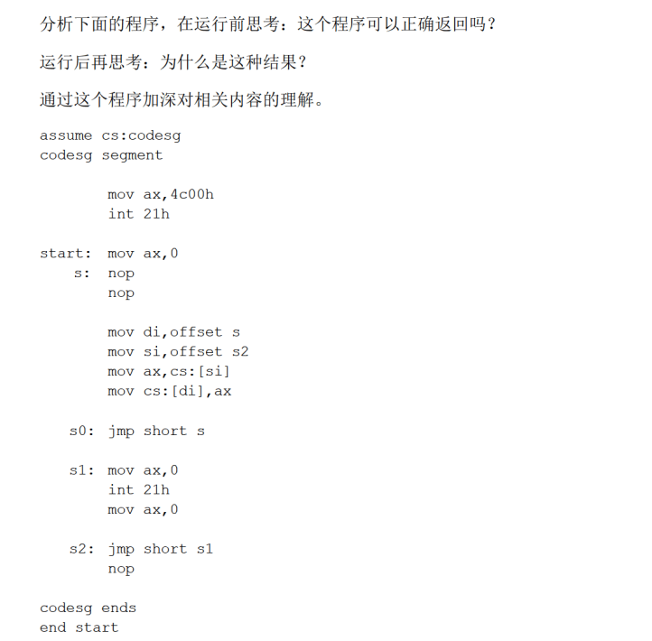

首先可以看到四个连续mov指令将s2部分的指令移动到s部分了，往后执行的时候，跳到s，然后会在s处执行jmp short s1，你猜他会去哪，会去s1吗？

==不会，这就是这题最坑的点，跳的是相对地址，编译时就已经确定了，以s为起点往前跳三句汇编指令，所以是能正常结束这个程序的==

### 实验9 根据材料编程 

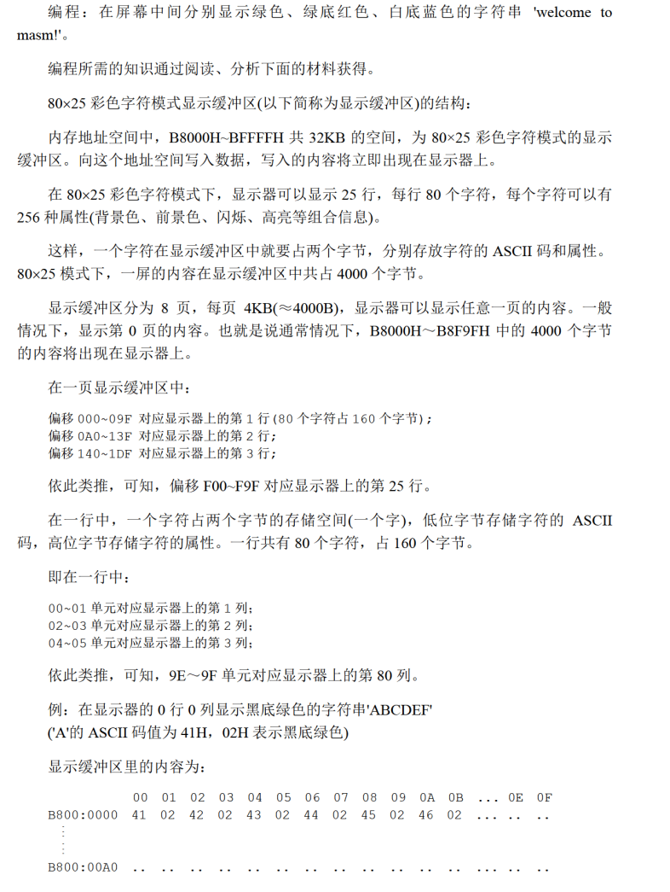

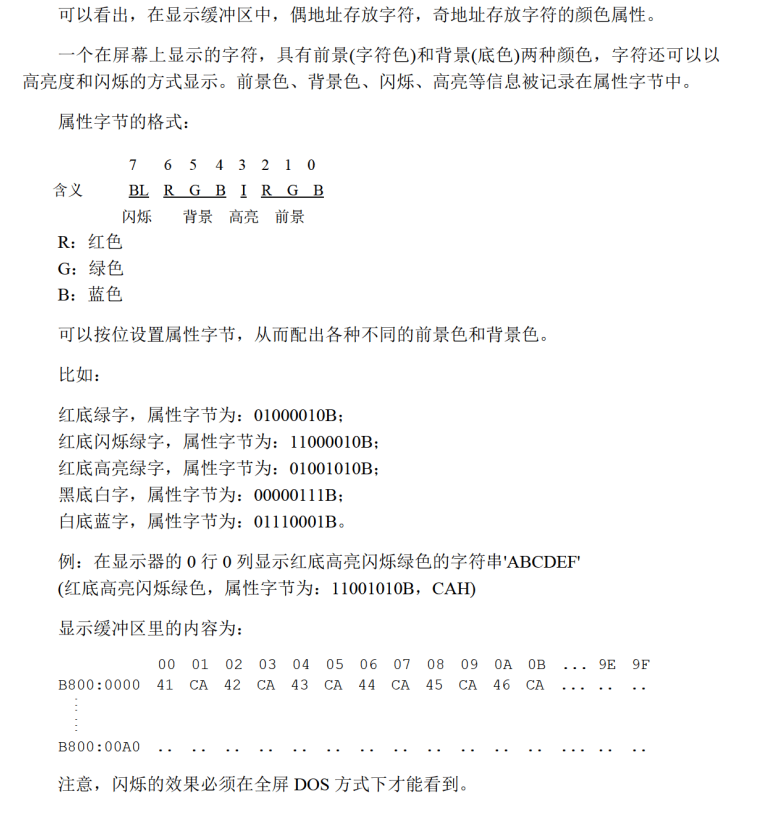

```asm
assume cs:code,ds:data,ss:stack
data segment
db 'welcome to masm!'  ;定义显示的字符串(16字节)
db 02h,24h,71h		   ;定义三种颜色属性 
data ends
 
stack segment ;栈段用来存放cx做多重循环
dw 8 dup(0)
stack ends
 
code segment
start:
mov ax,data
mov ds,ax
mov ax,stack
mov ss,ax
mov sp,10h
 
mov bx,0
mov ax,0b872h  		  ;算出中间位置段地址
mov es,ax
mov bp,10h ;作为颜色数据的指针
mov cx,3  			  ;3次大循环
s:
push cx
mov si,0;作为字符串的指针
mov di,0;作为目标地址的指针
mov cx,16 ;小循环16次
 
s0:
mov al,ds:[si] ;获取字符串的数据
mov es:[di+bx],al ;将字符串的数据低位保存到目标地址
inc di 		   ;目标地址前进
mov al,ds:[bp] ;获取颜色属性数据
mov es:[di+bx],al ;将颜色属性数据高位保存到目标地址
inc di		   ;目标地址前进
inc si         ;字符串前进
loop s0
 
pop cx 
add bx,0a0h ;进行下一行
inc bp     ;颜色也要变化
loop s 
mov ax,4c00h
int 21h
 
code ends 
end start
```

## CALL和RET指令
### ret和retf
ret指令用栈中数据修改IP，实现近转移
>相当于pop IP

retf指令用栈中数据修改CS和IP，实现远转移
>相当于pop IP pop CS

### 检测点10.1
![[picture/第十章/检测点10.1.png]]
1000H     0

### Call指令

两步操作
- 将当前IP或CS和IP压入栈
- 转移

### 依据位移进行转移的call指令

==都可以用jmp类比理解==
call 标号
>push IP 
>jmp near ptr 标号

### 检测点10.2
![[picture/第十章/检测点10.2.png]]
**6**

### 转移的目的地址在指令中的call指令

call far ptr 标号  相当于
>push CS
>push IP
>jmp far ptr 标号

### 检测点10.3
![[picture/第十章/检测点10.3.png]]
1010

### 转移地址在寄存器中的call指令

call 16位 reg 相当于
>push IP
>jmp 16位 reg

### 检测点10.4
![[picture/第十章/检测点10.4.png]]
0BH

### 转移地址在内存中的call指令

call word ptr 内存单元地址 相当于
>push IP
>jmp word ptr 内存单元地

call dword ptr 内存单元地址 相当于
>push CS
>push IP
>jmp dword ptr 内存单元地址

### 检测点10.5
![[picture/第十章/检测点10.5.png]]
(1) 3    因为call指的内存空间是ds:[0EH]所以，ip没变
(2) 0

### call和ret配合使用

不要想太复杂，其实就是用call将call的==下一句指令==的位置先记录好，然后先跳转执行call指令==中==的位置，当调用ret的时候，返回执行call记录的下一条指令

### mul指令

两相乘的数需要：
同时8位——一个默认放在AL，另一个放在reg或内存单元中
同时16位——一个默认在AX中，另一个放在reg或内存单元中
结果：
8位结果默认放在AX中
16位默认高位放DX，低位放AX


### 模块化程序设计

call和ret可以将某一部分变成一个模块

### 参数和结果传递的问题


![[picture/第十章/参数和结果传递问题.png]]
上面这段代码就清晰了什么时候用call和ret搭配，用编程语言来说，就像调函数一样

### 批量数据的传递

就是编程语言中类似传递一个数组

### 寄存器冲突的问题

主程序和子程序用到同一个寄存器时候就可能冲突
解决方法：
1.子程序换用其他寄存器
2.不使用会产生冲突的寄存器

### 实验10 编写子程序
![[picture/第十章/实验10一.png]]
```asm
assume cs:code
data segment
	db 'Welcome to masm!',0
data ends

code segment
	start:	mov dh,8
			mov dl,3
			mov cl,2
			
			mov ax,data
			mov ds,ax
			mov si,0
			call show_str
			
			mov ax,4c00h
			int 21h
			
 show_str:	mov ax,0B800H			; 确定输入字符串的段地址
 			mov es,ax
 			
 			mov al,00A0H			; 每行差00A0个字节，不能字母开头
 			mul dh					; 计算出的"行偏移地址"存在ax中
 			push ax					; 入栈，暂存
 			
 			mov al,2				; 每一列占两个字节，第2个字节
 			mul dl					; 计算出的"列偏移地址"存在ax中
 			
 			pop di					; 取出之前的"行偏移"
 			add di,ax				; "行偏移"+"列偏移"=总的偏移地址
 			
 	input:	push cx					; jczx要用到cx，会影响颜色的输入
	 		mov cx,[si]				; 从data中取字符
 			jcxz end_input			; 若取到末尾，跳转
 			mov es:[di],cx			
 			inc si					; 指向下一个字符
 		   	inc di					
 		   	pop cx
 			mov es:[di],cl			; 存入颜色信息
 			inc di
 			jmp short input
 			
end_input:	pop cx					; 在到了字符串末尾之后，
									; 之前的cx还在栈中，要出栈
									; 否则ret从栈中取出原来的IP值时会出错
			ret
			
code ends
end start

```
### 课程设计 1 
![[picture/第十章/课程设计1.png]]
```asm
assume cs:code,ds:data,ss:stack
;每写一个部分前后空行隔开，并且中间加上注释
;!!!编程序不能光想，还要在纸上演算

;改初始的值+仔细观察换行字符si的变化
data segment
	db '1975','1976','1977','1978','1979','1980','1981','1982','1983'
	db '1984','1985','1986','1987','1988','1989','1990','1991','1992'
	db '1993','1994','1995'
    ;db为字节类型
    ;偏移量为0+si*4B
	dd 16,22,382,1356,2390,8000,16000,24486,50065,97479,140417,197514
	dd 345980,590827,803530,1183000,1843000,2759000,3753000,4649000,5937000
	;dd为双字类型
	;偏移量为84+si*4B
	dw 3,7,9,13,28,38,130,220,476,778,1001,1442,2258,2793,4037,5635,8226
	dw 11542,14430,15257,17800
	;dw为字类型,字类型共有2B，压栈四次然后出栈四次
	;偏移量为168+si*2B
	;发现偏移量不对时就应该检查偏移量的地址
	
	;之前偏移量的公式运算错误导致程序出错
data ends

stack segment
	db 200 dup(0)
stack ends
;思路：用db存储应该加入的空格数量,然后按行来输出
code segment
start:mov ax,data
	  mov ds,ax
	  mov si,0;ds:bp指向data部分区域
	  mov cx,21
	  mov ax,0b800h
	  mov es,ax
	  mov si,0000h;es:si屏幕显示区域
	  mov ax,stack
	  mov ss,ax
	  mov sp,00c8h
	  mov bl,0;bl用于指向现在循环的是第几行
	  
	  ;s用于每行的大循环
	  ;bl数据出现问题，si数据出现问题
    s:
	  ;ip = 001d,si = 003e
	  
	  push cx
	  mov cx,4
	  mov bh,32;bh用来记录0的ascii码
	  
	  mov al,160
	  mov ah,bl
	  mul ah
	  mov si,ax;屏幕显示区域的段内偏移=行数*每行偏移量
	  ;算出具体每行的偏移量
	  
	  ;循环2:si = 00a0
	  
	  ;s1循环用于每行开始填14个空格
   s1:;mov es:[si],bh
      inc si
	  inc si
	  loop s1;填补空格
	  
	  mov bh,0
	  mov al,bl
	  mov ah,4
	  mul ah;算出0+bl*4B为年份的字符串所在的位置
	  ;结果在ax中
      
	  mov bp,ax
	  mov cx,4;将字符串的偏移量放入bp中
	  ;并设置循环次数
	  
	  ;s2循环用于将表示年份的字符串放入
	  ;屏幕显示区域的内存之中
   s2:mov al,ds:[bp]
      mov es:[si],al
	  inc bp
	  inc si
	  mov al,02h
	  mov es:[si],al
	  inc si
	  loop s2;每次放入一个字节，循环4次
      ;ip = 0049
	  
	  ;s3循环用于输出完年份之后中间再加5个空格
	  mov cx,5
	  mov bh,32
   s3:;mov es:[si],bh
      inc si
	  ;mov al,02h
	  ;mov es:[si],al
	  inc si
	  loop s3
	  
	  ;算出下一行数字所显示的偏移量
	  ;公式为4*21+bl*4B,即84+bl*4B,bl为每行的行号
	  ;之前这里出现bug，错写为84+bl*8B
	  mov al,bl
	  mov ah,4
	  mul ah
	  add ax,84
	  
	  mov bp,ax;bp保存偏移量
	  
	  mov ax,ds:[bp]
	  inc bp
	  inc bp
	  mov dx,ds:[bp]
	  inc bp
	  inc bp;高位数字保存在dx之中
	  ;低位数字保存在ax中
	  mov cx,10;除数保存在cx之中
	  ;ip = 0070h
	  
	  push dx
	  push ax;数据压栈，方便后面做除法使用
	  
	  ;ip = 0082,si = 001a
	  
	  call calcul
	  ;调用函数时会将主函数地址压栈，方便函数返回
	  
	  mov cx,4
	  mov al,32
	  mov ah,02h
   s8:;mov es:[si],al
      inc si
	  ;mov es:[si],ah
	  inc si
	  loop s8;补上4个空格
	  
	  ;ip = 0096,si = 0030
	  
	  ;计算下一个数字在data段中的偏移量
	  ;下一个数字偏移量计算公式为8*21+bl*2B
	  ;即168+bl*2B
	  mov ah,2
	  mov al,bl
	  mul ah
	  add ax,168
	  mov bp,ax
	  
	  ;si = 0030
	  
	  mov ax,ds:[bp]
	  inc bp
	  inc bp
	  ;这边出现bug，少加一次bp
      mov dx,0000
	  mov cx,10;将相应数字赋值,dx=0000
	  ;ax = 对应值
	  
	  push ax;保存数据，方便后面做除法使用
	  
	  ;bp = 00aa,si = 0030
	  
	  call calcul
	  ;就一个字，用ax存储,dx存储0
	  ;继续转换为ascii码,这里面出来的ax，bx与cx无意义
	  ;有意义的数已存入屏幕存储区
	  
	  ;ip = 00af,si = 003e
	  
	  pop cx
	  pop ax
	  pop dx
	;先将下面注释掉
	  call divdw;恢复数字进行除法
	  ;除法后dx保存高位商，ax保存低位商
	  call calcul;将数字转换为ascii码
	  
      pop cx
      inc bl;恢复循环次数and行号加一
	  sub cx,1
	  jcxz ok
	  jmp s
	  ;之前这里写错为loop s8导致屏幕一直显示绿色
	  ;debug循环只运行到了2793没有运行出最后的结果
	  ;说明中间存在bug
	  ;功能实现指令的无条件跳转
	  ;****这里直接loop无法实现，必须借助jcxz进行跳转
	  
   ok:mov ax,4c00h
	  int 21h
	  
calcul:;该函数计算将高16位保存在dx中
;低16位保存在ax中的数转换为ascii码并顺序
;存储在屏幕显示区域的内存中，数位不够7位时
;补空格

;***bug的出现:在调用内部的时候si的值变为0000
      mov cx,10
	  mov di,0
	  
      ;将余数压栈
	  ;if(ax == 0 && dx == 0)
	  ;退循环
	  ;else
	  ;将cx改为10
	  ;继续循环
	   
	   ;si = 001a
	   ;ip = 00c7
	   
   s4:call divdw
   
      ;ip = 00B1
   
      inc di;di记录循环次数
	  
	  ;ip = 00b4
	  
	  push cx
	  push dx
	  push ax
	  mov cx,ax;
	  jcxz ok1;判断ax是否为0
	  ;将余数弹入栈中，方便逆序取出
	  
	  pop ax;
	  pop dx;
	  mov cx,10
	  jmp s4;不为零时恢复数据继续循环
	  
  ok1:mov cx,dx
      jcxz ok2;判断dx是否为0
  
  ok2:pop ax
      pop dx
	  
	  mov cx,di;cx存储弹栈的次数
	  mov ax,di;
	  mov dx,7
	  sub dx,ax;dx = 7-ax保存空格
	  ;的循环次数
	  
   s6:pop ax
      add al,30h
	  mov es:[si],al
	  inc si
	  mov al,02h
	  mov es:[si],al
	  inc si
	  loop s6
	  ;将对应数字转换为ascii码存入
	  ;屏幕显示区域的内存之中
   
      mov cx,dx
   s7:;mov al,32
      ;mov es:[si],al
	  inc si
	  ;mov al,02h
	  ;mov es:[si],al
	  inc si;补上后面的空格
	  loop s7
      
      ret

divdw:push si

	  ;***之前这里存在bug，mov si,dx改变了
	  ;si的值

	  mov si,dx;si存储高16位
	  ;si = 000fh
	  mov bp,ax;bp存储低16位
	  ;bp = 4240h
	  mov dx,0000h
	  ;dx = 0000h
	  mov ax,si
	  ;ax = 000fh
	  div cx
	  ;这里计算H/N*65536
	  
	  push ax;商压入栈，高八位的dx肯定
	  ;dx = 0005h压入栈中
	  
	  ;之前这里写错了ax为商，dx为余数
	  ;dx直接就在高位了，不需要任何的操作
	  ;mov dx,cx;将余数挂到高位
	  ;dx = 0005h
	  
	  mov ax,bp;将低16位挂到ax
	  ;ax = 4240h，高位为余数本身就存储在dx中
	  div cx;这里计算H%N*65536+L
	  
	  mov cx,dx;cx保存余数
	  ;mov ax,dx;ax保存低16位
	  pop dx;dx保存高16位
	  ;低八位的ax即为商，无需操作
	  pop si
	  ret

code ends
end start

```
==真要写汇编程序还是难，CPU干烧了==

## 标志寄存器

CPU内部还有一种特殊寄存器
- 用来储存相关指令的某些执行结果
- 用来为CPU执行相关指令提供行为依据
- 用来控制CPU的相关工作方式

*简称flag*
![[picture/第十一章/flag寄存器的各位示意图.png]]
从图上可以看出来，有些位是没有特殊含义的，只有部分是标志位

### ZF标志

flag的第六位，零标志位。==记录执行相关指令后，结果是否为0==
```asm
mov ax,1
sub ax,1
;执行后，结果为0，zf = 1
mov ax,2
sub ax,1
;执行后，结果不为0，zf = 0
```
一般运算指令会对标志寄存器有影响

### PF标志

flag的第2位是PF，奇偶标志位。==记录执行相关指令后，结果bit位中1的个数是否为偶数==
```asm
mov al,1
add al,10
;执行后，结果为00001011B，3个1，pf = 0
mov al,1
or al,2
;执行后，结果为00000011B，2个1，pf = 1
```

### SF标志

flag的第7位是SF，符号标志位。==记录执行相关指令后，结果是否为负==
计算机可以将二进制数看成正数或者负数
```asm
mov al,10000001B
add al,1
;执行后，结果为10000010B，结果为负吗，sf = 1
mov al,10000001B
add al,01111111B
;执行后，结果为00000000B，结果不为负，sf = 0
```
这时候你可能会问，我如果其实没将它看成负数呢，CPU不管你是否看成负数，它都会帮你按照负数计算，只不过用不用是你的事

### 检测点11.1

![[picture/第十一章/检测点11.1.png]]
	          ZF  PF  SF
sub al,al 1   1   0 结果0b 1 1 0 为0 0个1 非负
mov al,1  1   1   0 传送指令不影响标志寄存器的状态
push ax   1   1   0 传送指令不影响标志寄存器的状态
pop bx    1   1   0 传送指令不影响标志寄存器的状态
add al,bl 0   0   0 结果10b 不为0 1个1 非负
add al,10 0   1   0 结果1100b 2个1 非负
mul al    0   1   0 结果10010000b 2个1 非负

### CF标志

flag的第0位是CF，进位标志位。==无符号运算时，记录运算结果的最高有效位向更高位的进位值/从更高位的借位值==
```asm
mov al,98H
add al,al
;执行后，结果为30H，cf = 1
add al,al
;执行后，结果为60H，cf = 0
```

### OF标志

flag的第11位是OF，溢出标志位。==执行指令后，结果是否溢出==
```asm
mov al,98
add al,99
;执行后，结果溢出，of = 1
mov al,0F0H
add al,78H
;执行后，结果未溢出，of = 0
```

### 检测点11.2

![[picture/第十一章/检测点11.2.png]]
				CF    OF     ZF    PF   SF
sub al,al   0     0      1     1     0             
mov al,10h  0     0      1     1     0
add al,90h  0     0      0     1     1
mov al,80h  0     0      0     1     1
add al,80h  1     1      1     1     0
mov al,0fch 1     1      1     1     0
add al,05h  1     0      0     0     0
mov al,7dh  1     0      0     0     0
add al,0bh  0     1      0     1     1 

### adc指令

带进位的加法指令，它利用了CF位上记录的进位值
指令 abc 操作对象1,操作对象2 执行的是
>(ax) = (ax)+(bx)+CF

### sbb指令

带借位减法指令，它利用了CF位上记录的借位值
指令 sbb 操作对象1,操作对象2 执行的是
>(ax) = (ax)-(bx)-CF

### cmp指令

比较指令，功能相当于减法指令，只是不保存结果，目的是影响标志寄存器
指令 cmp 操作对象1,操作对象2 执行的是
>(对象1)-(对象2)
执行指令后zf、pf、sf、cf、of的值都会改

![[picture/第十一章/cmp的用处.png]]
这些都是它的用处

### 检测比较结果的条件转移指令

![[picture/第十一章/检测比较结果的条件转移指令.png]]
上图指令通常和cmp搭配使用

### 检测点11.3

![[picture/第十一章/检测点11.3.png]]
(1) jb s0 ja s0 
(2) jna s0 jnb s0

### DF标志和 串传送指令

flag的第十位是DF，方向标志位。==在串处理指令中，控制每次操作后si、di的增减==
指令 movsb 相当于执行
>((es)\*16+(di)) = ((ds)\*16+(si))
>如果df = 0 (si) = (si)+1 (di)=(di)+1
>如果df = 1 (si) = (si)-1 (di)=(di)-1 

### pushf和popf

pushf是将标志寄存器的值压栈，popf是从栈中弹出数据送入标志寄存器中

### 检测点11.4

![[picture/第十一章/检测点11.4.png]]

(1) 45h 解释：通过操作标志寄存器的值为000000001000101b 最后ax的值是45H

### 标志寄存器在Debug中的表示

![[picture/第十一章/标志寄存器在Debug中的表示.png]]

### 实验11 编写子程序

![[picture/第十一章/实验11.png]]
```asm
assume cs:code,ds:data
data segment
    db 'welcome to masm!haha,I am happy!',0
data ends
 
stack segment
    db 0
stack ends
 
code segment
start:
    mov ax,data     ;设置ds指向data段
    mov ds,ax
    mov ax,stack    ;设置ss指向stack段
    mov ss,ax
    mov sp,10H
 
    mov dh,11H      ;指定屏幕显示的行号
    mov dl,3H       ;指定屏幕显示的列号
    mov bl,0CH       ;指定屏幕显示的字符属性
    call show_str   ;将转换前的字符串显示在屏幕上
 
    mov si,0
    call letterc    ;将小写字母转为大写字母
 
    mov dh,16H      ;指定屏幕显示的行号
    mov dl,3H       ;指定屏幕显示的列号
    mov bl,2H       ;指定屏幕显示的字符属性
    call show_str   ;将转换后的字符串显示在屏幕上
 
    mov ax,4c00H            ;程序返回
    int 21H
 
show_str:
    ;功能：将指定位置、任意长度、以0结尾的字符串显示
    ;   在屏幕指定位置上。
    ;参数：ds:si指向字符串首地址，dh是指定行号，dl是指定列号，
    ;   bl是指定属性字节
    ;返回：无
    
    ;实现思路：利用movsb传送指令，将指定字符串传送到显存地址中
 
    push es     ;将用到的寄存器压入栈暂存
    push di
    push si 
    push ax
    push dx
    push cx
 
    mov ax,0B800H   ;设置es指向显存区域段地址
    mov es,ax
 
    mov ax,0A0H       ;计算显存中首字符的偏移地址
    mul dh
    mov dh,0
    add ax,dx
    add ax,dx
    mov di,ax
 
    mov cx,0
    cld             ;设置DF标志位为0，传送正向进行
    show_next:      ;逐个字符进行显示
    mov cl,ds:[si]    ;取一个字符字节
    jcxz show_ok    ;若当前字节为0，则跳转
    movsb           ;从ds:[si]向es:[di]传送一个字节，之后自动si+1，di+1
    mov es:[di],bl  ;将属性字节复制到显存中
    inc di
    jmp show_next
 
    show_ok:        ;程序返回
    pop cx
    pop dx
    pop ax
    pop si
    pop di
    pop es
 
    ret
 
letterc:
    ;功能：将指定位置、任意长度、以0结尾的字符串中
    ;       所有小写字母转为大写字母
    ;参数：ds:si指向字符串首地址
    ;返回：无
 
    ;实现思路：用循环遍历每一个字符字节，检测是否为
    ;小写字母，若是，则转为大写字母，否则下一个。
    ;遇到0则结束循环，程序返回。
 
    push cx         ;将用到的寄存器压入栈
    push si
 
    mov cx,0        ;初始化
    s:
    mov cl,ds:[si]  ;取当前字符字节
    jcxz ok      ;若当前字节为0，则跳转
    cmp cx,61H  ;与字符'a'比较
    jb next     ;若<字符'a'则跳转
    cmp cx,7AH  ;与字符'z'比较
    ja next     ;若>字符'z'则跳转
    sub cx,20H  ;执行这句的，就是小写字母，则转大写
    mov ds:[si],cl  ;将大写字母存到内存中
    jmp next    ;转换后也跳转到下一个
 
    next:       ;取下一个字符
    inc cx
    inc si
    loop s
    ok:         ;程序返回
    pop si      ;在返回前将寄存器的值pop出来
    pop cx
    ret     
 
code ends
end start

```

## 内中断

CPU都具备一种能力，接收中断信息，CPU会不再接着向下执行，而是转去处理这个特殊信息
中断信息可以来自CPU内部和外部，这章主要讨龙CPU内部中断信息

### 内中断的产生

四种情况可以产生内部中断信息，用中断类型码来标识
- 除法错误：0
- 单步执行：1
- 执行into指令：4
- 执行int指令：格式为int n，n是多少，中断类型码就是多少

### 中断处理程序

如何对中断信息进行处理，可以自行编程决定

### 中断向量表

用中断类型码来找到对应中断处理程序的入口地址
![[picture/第十二章/中断向量表.png]]
其中存放256个中断源所对应的中断处理程序入口
但是，CPU如何找到中断向量表呢？
8086中，内存0000:0000到0000:03FF的1024个单元(因为一个表项占两个字)中存放着中断向量表

### 检测点12.1

![[picture/第十二章/检测点12.1.png]]
(1)0070:018BH
(2)4N,4N+2

### 中断过程

找到入口地址之后就会设置CS和IP，CPU完成着整个工作的过程称为中断过程
- 获得中断类型码
- 标志寄存器的值入栈
- 设置标志寄存器的第8位TF和第9位IF的值为0
- CS的内容入栈
- IP的内容入栈
- 读取入口地址设置IP和CS

### 中断处理程序和iret指令

中断处理程序编写方法与子程序类似
- 保存用到的寄存器
- 处理中断
- 恢复用到的寄存器
- 用iret指令返回(内部是pop IP 、 pop CS和 popf)

### 除法错误中断的处理

![[picture/第十二章/0号中断的处理.png]]
显示Divide overflow后返回操作系统

### 编程处理0号中断

要用一段不会使用到的内存来存程序，之前提过，按理说要向操作系统申请，但是为了便于学习，我们直接找一段就行了

```asm
assume cs:code
code segment
start: do0 安装程序
		设置中断向量表
		mov ax,4c00h
		int 21h
do0:    显示字符串"overflow!"
		mov ax,4c00h
		int 21h
code ends

end start
```

### 安装

用movsb指令，将do0的代码送入0:200处
```asm
assume cs:code
code segment

start:  mov ax,cs
		mov ds,ax
		mov si,offset do0   ;设置ds:si指向源地址

		mov ax,0
		mov es,ax
		mov di,200h          ;设置es:di指向目的地址

		mov cx,offest de0end-offet do0  ;设置cx为传输长度,此处运用编译器来计算
		cld                  ;设置传输方向为正
		rep movsb

		设置中断向量表

		mov ax,4c00h
		int 24h
do0:    显示字符串"overflow"
		mov ax,4C00h
		int 21h

do0end:nop

code ends
end start
```

### do0

```asm
do0: jmp short do0start ;字符串数据放哪里尤为重要
	 db "overflow!"
```

### 设置中断向量

```asm
mov ax,0
mov es,ax
mov word ptr es:[0*4],200h
mov word ptr es:[0*4+2],0
```

### 单步中断

- 取得中断码1
- 标志寄存器入栈，TF、IF设置为0
- CS、IP入栈
- (IP) = (1\*4)，(CS) = (1\*4 + 2)
Debug其实就是提供了单步中断的中断处理程序


### 响应中断的特殊情况

正常情况下，CPU检测到中断信息，就响应中断，但某些特殊情况，即使发生中断也不会响应

### 实验12

![[picture/第十二章/实验12.png]]
```asm
assume cs:code

code segment

	start:	mov ax,cs
			mov ds,ax
			mov si,offset do0		; 设置ds:si指向源地址
			
			mov ax,0
			mov es,ax
			mov di,200h				; 设置es:di指向目的地址
			
			mov cx,offset do0end-offset do0
			
			cld						; 设置正向传输
			rep movsb				; 复制do0的代码到指定内存中
			
			mov ax,0				; 设置中断向量表的表项
			mov es,ax
			mov word ptr es:[0],200h
			mov word ptr es:[2],0
			
			mov ax,4c00h
			int 21h
			
	  do0:	jmp short do0start
	  		db "divide error!"		; 使用一部分内存存储字符串
	  		
 do0start:	mov ax,cs
 			mov ds,ax
 			mov si,202h			; 设置ds:si指向字符串
 			
 			mov ax,0b800h
 			mov es,ax
 			mov di,12*160+33*2	; 设置es:di指向显存空间的中间位置
 			
 			mov cx,13			; 长度不同，循环次数和内存中的位置不同
 		s:	mov al,[si]
 			mov es:[di],al
			mov byte ptr es:[di+1],2	; 给字符增加颜色
 			inc si
 			add di,2			
 			loop s
 			
	  		mov ax,4c00h
	  		int 21h
	  		
   do0end:	nop
	  		
code ends
end start

```

## int指令

接下来讲由int指令引发的中断

### int 指令

格式：int n
执行过程：
- 取中断类型码n
- 标志寄存器入栈
- IF = 0，T F= 0
- CS、IP入栈
- (IP) = (n\*4)，(CS) = (n\*4 + 2)
在程序中，我们可以用int n 调用相关的子程序，这些程序简称为**中断例程**

### 编写供应用程序调用的中断例程

和上一章一样，自己编写需要，写中断子程序和安装中断子程序

### 检测点13.1

![[picture/第十三章/检测点13.1.png]]
(1)-32768~32767 (BX是16位寄存器)
(2)
```asm
assume cs:code
code segment
start:
	mov ax,0
	mov es,ax
	mov di,200h
	mov ax,cs
	mov ds,ax 
	mov si,offset lp  
	mov cx,offset lpend-offset lp 
	cld
	rep movsb
	mov ax,0
	mov es,ax 
	mov word ptr es:[7ch*4],200h
	mov word ptr es:[7ch*4+2],0h
	mov ax,4c00h 
	int 21h
lp:
	push bp 
	mov bp,sp 
	add [bp+2],bx 	;将IP的内容设置为标号s的偏移地址
	pop bp 
	iret 
lpend:
	nop
code ends 
end start

```

### BIOS和DOS所提供的中断例程

系统板ROM中存放着一套程序，称为BIOS(基本输入输出系统)，BIOS主要包括：
- 硬件系统的检测和初始化程序
- 外部中断和内部中断的中断例程
- 用于对硬件设备进行I/O操作的中断例程
- 其他和硬件系统相关的中断例程

### BIOS和DOS中断例程的安装过程

之前我们自己写的需要运行安装程序才能使用，BIOS和DOS提供的中断例程是如何安装的呢？
- 开机，CPU初始化(CS) = 0FFFH，(IP) = 0，FFFF:0处有跳转指令，转去执行初始化程序
- 初始化程序将建立BIOS所支持的中断向量，即更新中断向量表
- 初始化完成后，调用int 19h进行操作系统引导，之后交还控制权给操作系统
- DOS启动后，完成其他工作外，还将提供例程装入内存

### 检测点13.2

![[picture/第十三章/检测点13.2.png]]
(1)错 该处指令只读，不可编程写入
(2)错 调用int 19h后DOS才启动，此时19h已经在内存中了

### 实验13

![[picture/第十三章/实验13一.png]]


![[picture/第十三章/实验13二.png]]
(1)
```asm
assume cs:code

data segment
	db "welcome to masm! ",0
data ends

code segment

start:
	mov dh,10
	mov dl,10
	mov cl,2
	mov ax,data
	mov ds,ax
	mov si,0
	int 7ch

	mov ax,4c00h
	int 21h

code ends
end start	

```

```asm
assume cs:code

code segment

start:
	mov ax,cs
	mov ds,ax
	mov si,offset do7c
	mov ax,0
	mov es,ax
	mov di,200h							;设置es:di指向目的地址
	mov cx,offset do7cend-offset do7c   ;设置cx为传输长度
	cld									;设置传输方向为正
	rep movsb

	;设置中断向量表
	mov ax,0
	mov es,ax
	mov word ptr es:[7ch*4],200h	
	mov word ptr es:[7ch*4+2],0

	mov ax,4c00h
	int 21h

do7c:
	push ax
	push es
	push di
	push bx
	push cx
	push si

	mov ax,0b800h
	mov es,ax
	sub di,di

	;计算显示位置
	mov ax,160
	mul dh
	add di,ax

	mov ax,2
	mul dl
	add di,ax

	mov bl,cl 						;后面要用到cl，放入bl中

do7c_show:
	mov cl,ds:[si]
	mov ch,0
	jcxz ok

	mov es:[di],cl
	mov es:[di+1],bl				;高位属性，颜色
	add di,2

	inc si

	jmp short do7c_show

ok:	
	pop si
	pop cx
	pop bx
	pop di
	pop es
	pop ax

	iret

do7cend:nop

code ends
end start

```
(2)
```asm
assume cs:code
code segment
start:
	mov ax,0b800h
	mov es,ax
	mov di,160*12
	mov bx,offset s-offset se 				;设置从标号se到标号s的转移位移
	mov cx,80
s:
	mov byte ptr es:[di],'!'
	add di,2
	int 7ch									;如果(cx)≠0，转移到标号s处
se:
	nop
	mov ax,4c00h
	int 21h
code ends
end start		

```

```asm
assume cs:code
code segment

start:
	mov ax,cs
	mov ds,ax
	mov si,offset lp
	mov ax,0
	mov es,ax
	mov di,200h
	mov cx,offset lpred-offset lp
	cld
	rep movsb

	;设置中断向量表
	mov ax,0
	mov es,ax
	mov word ptr es:[7ch*4],200h	
	mov word ptr es:[7ch*4+2],0

	mov ax,4c00h
	int 21h

lp:
	push bp
	mov bp,sp
	dec cx
	jcxz lpret
	add [bp+2],bx
lpret:
	pop bp
	iret	
lpred:
	nop	

code ends
end start		

```
(3)
```asm
assume cs:code

code segment
	s1:	db 'Good,better,best,','$'
	s2: db 'Never let it rest','$'
	s3: db 'Till good is better','$'
	s4: db 'And better,best.','$'
	s : dw offset s1,offset s2,offset s3,offset s4
	row: db 2,4,6,8

strat:
	mov ax,cs
	mov ds,ax
	mov bx,offset s
	mov si,offset row
	mov cx,4
ok:
	mov bh,0
	mov dh,ds:[si]
	mov dl,0
	mov ah,2
	int 10h

	mov dx,ds:[bx]
	mov ah,9
	int 21h

	inc si
	add bx,2
	loop ok

	mov ax,4c00h
	int 21h
code ends
end strat		

```

## 端口

CPU通过总线相连的芯片除了各种寄存器外，还有三种芯片
- 接口卡
- 主板上的接口芯片
- 其他芯片

### 端口的读写

CPU通过端口地址来定位端口，不能用mov,push,pop等内存读写指令。端口的读写指令只有两条**in和out**
访问端口：
> in al,60h     ;从60h号端口读入一个字节

在in和out指令中，只能使用ax(16位)或al(8位)来存放端口中读入的数据或要发送到端口中的数据

### CMOS RAM 芯片

特征：
- 包含一个实时钟和128存储单元的RAM存储器
- 靠电池供电，关机后仍能工作，信息不丢失
- 端口为70h，71h

### shl和shr指令

shl是逻辑左移指令，功能是
- 将一个寄存器或内存单元的数据向左位移
- 最后移出的一位写入CF
- 最低位用0补充

shr类似且相反

### CMOS RAM中存储的时间信息

内存时钟占用0-0dh单元来保存时间信息，其余用来保存系统配置信息
内存中年月日等长度都为1字节
>BCD码是4位二进制数，一个字节可表示两个BCD码

## 外中断

CPU除了运算能力，还需要I/O能力

### 接口芯片和端口

外设的输入不直接送入内存和CPU，而送入接口芯片的端口。输出类似

### 外中断信息

外中断源有两类：
- 可屏蔽中断
可以不响应的外中断，要看标志寄存器的IF位的设置(1则响应，0则不响应)
- 不可屏蔽中断
中断类型码固定为2，所以中断过程中不需要取中断类型码

### PC机键盘的处理过程

**键盘输入：**
每个键相当于一个开关，每个键有芯片对开关状态进行扫描，扫描码说明了键的位置，送入60h端口中
>断码(松开产生) = 通码(按下产生) + 80h

**引发9号中断：**
如果IF=1，则响应中断，转去执行int 9中断例程

**执行int 9 中断例程：**
- 读出60h端口中的扫描码
- 字符键则将扫描码和对应字符码送入内存，控制/切换键则转变为状态字节写入
- 对键盘系统进行相关的控制

## 直接定址表

### 描述了单元长度的标号
>我们之前也用过标号来标记指令等的起始地址
>如：mov si,offset a

但是我们还可以使用一种标号，不但表示内存单元的地址，还表示内存单元的长度
```asm
assume cs:code
code segment
	  a ab 1,2,3,4,5,6,7,8
	  b dw 0

start:mov si,0
      mov cx,8
    s:mov al,a[si]
      mov ah,0
      add b,ax
      inc si
      loop s
      mov ax,4c00h
      int 21h
code ends
end start
```
code段使用标号a、b时没有“:”，它们是同时描述内存地址和单元长度的标号

>指令：mov ax,b
>相当于：mov ax,cs:[8]

### 直接定址表

利用表，在两个数据集合之间建立一种映射关系，目的有3个：
- 为了算法的清晰和简洁
- 为了加快运算速度
- 为了使程序易于扩充

### 程序入口地址的直接定址表

在直接定址表中存储子程序的地址，从而方便地实现不同子程序的调用

## 使用BIOS进行键盘输入和磁盘读写

### int 9中断例程对键盘输入的处理

### 使用int 16h中断例程读取键盘缓冲区

功能是从键盘缓冲区中读取一个键盘输入

### 应用int 13h中断例程对磁盘进行读写


