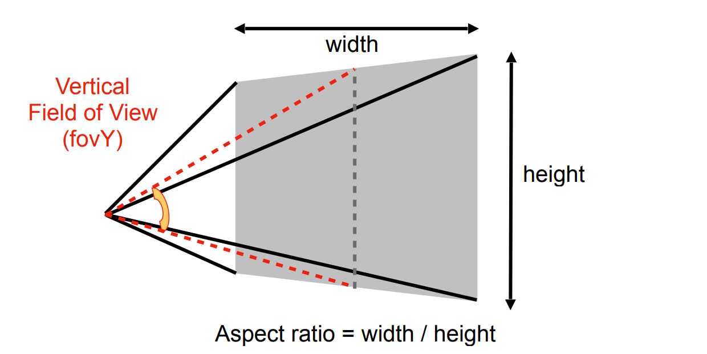
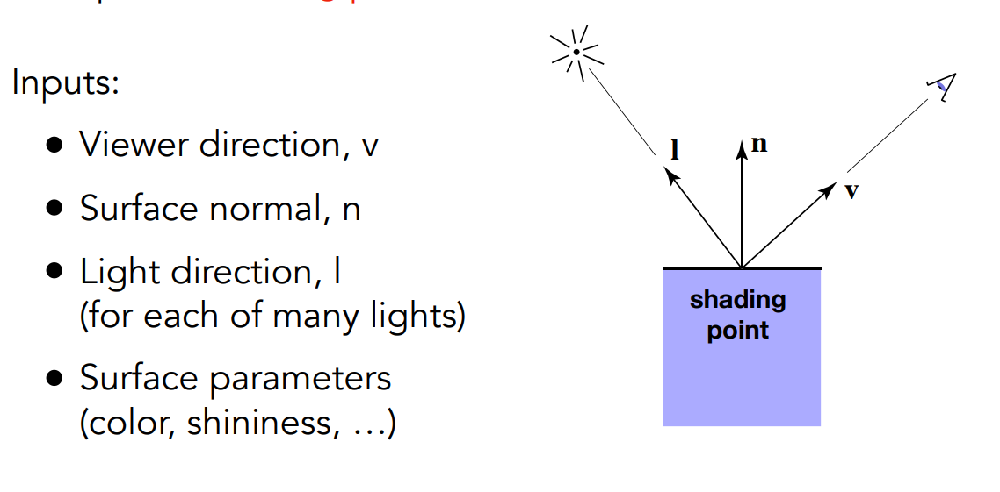
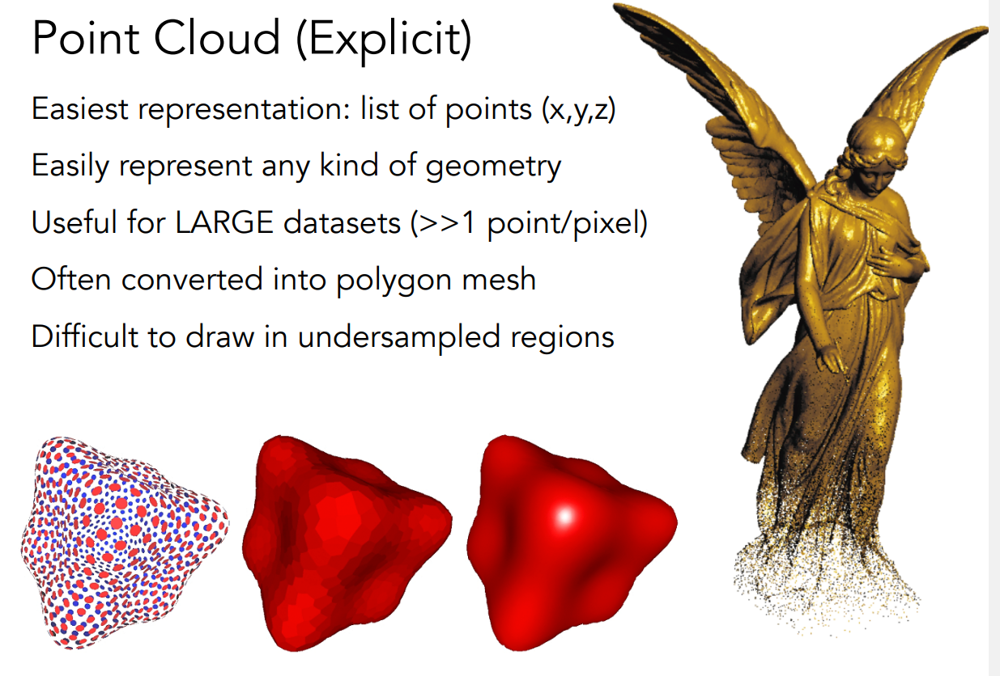
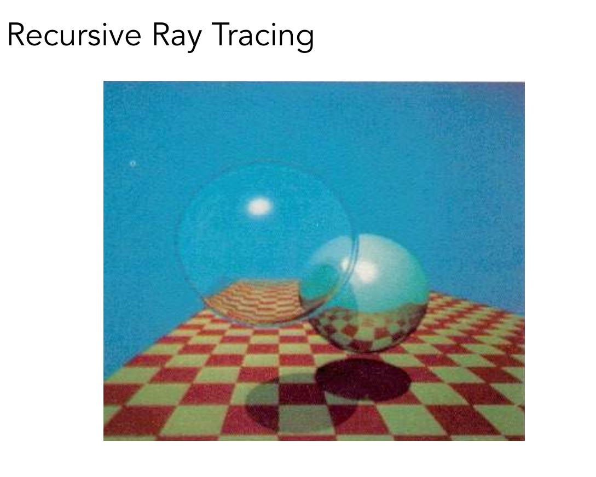
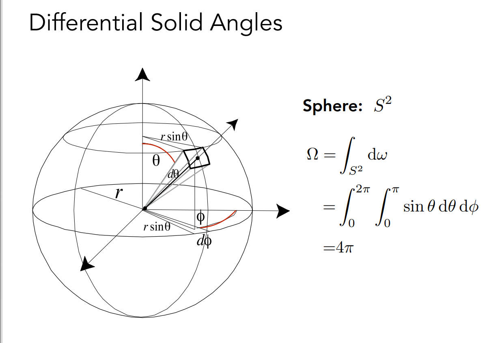

## 计算机图形学

😀 😃 🥰 😍 😘

❤️ ✨⭐ ❗❓❕❔

✊✌️ ✋✋ ☝️ 👏 🤝

☀️ ☔ ☁️ ❄️ ⛄ ⚡ ⛅

⛪ ⛺ ⛲ ⛵ ⛵ ⚓ ✈️ ⛽ ⚠️ ♨️

1️⃣ 2️⃣ 3️⃣ 4️⃣ 5️⃣ 6️⃣ 7️⃣ 8️⃣ 9️⃣ 0️⃣

️⃣ ◀️ ⬇️ ▶️ ⬅️ ↙️ ↘️ ➡️ ⬆️ ↖️ ↗️
⏬ ⏫ ⤵️ ⤴️ ↩️ ↪️ ↔️ ↕️ ⏪ ⏩ ℹ️ ️ ️ ️

♿ ㊙️ ㊗️ Ⓜ️ ⛔ ✳️ ❇️ ✴️

♈ ♉ ♊ ♋ ♌ ♍ ♎ ♏ ♐ ♑ ♒ ♓ ⛎

❎ ️ ️ ️ ♻️ ©️ ®️ ™️ ❌ ❗ ‼️ ⁉️ ⭕ ✖️ ➕ ➖ ➗ ✔️

☑️ ➰ 〰️ 〽️ ▪️ ▫️ ◾ ◽ ◼️ ◻️ ⬛ ⬜ ✅ ⚫ ⚪
————————————————

注意：会使用较多的英文，因为许多相关专业名词不能准确的翻译

## Lecture 1：Overview of Computer Graphics

此节查看pdf——Overview of Computer Graphics：Lecture 1

## Lecture 2：Review of Linear Algebra

向量

**点乘**

掌握点乘相关性质——此处略

**叉乘**

相关计算：

==重要应用==：在之后学习光栅化的时候，用于判断某个点是否在三角形之内

首先我们要知道，我们可以判断点在直线的左侧还是右

p在三角形内，会有CA向量和CP向量的叉乘，AB向量和AP向量的叉乘，BC向量和BP向量的叉乘==正负一致==

**矩阵**：是图形学中十分重要的工具，巩固线代基础知识，这里不过多赘述

## Lecture 3：Transformation⭐⭐⭐

### 二维：

缩放：

翻转：

切变：

旋转：

平移：发现这就不是线性变换了，==我们要把这种情况也统一到同一个矩阵中==

**其次坐标的应用**😘😘

应用齐次坐标的平移：

所有都统一到同一个矩阵了（齐次坐标要比原维数多1）

逆矩阵的意义：

**逆矩阵就是原变换的反过程**

矩阵的相乘表示变换：

进行变换时我们是要将原矩阵左乘变换矩阵（千万不能右乘，这是完全不同的意思，具体参考线代知识）

假如我们要按顺序进行A~1~A~2~A~3~A~4~ ………… A~n~个变换，要按照

就是一直左乘变换对应的矩阵（==越在左边的越晚做==），其实也可以将所有矩阵换算成一个矩阵后再左乘

思考：假如我想要变回原来的样子应该怎么做？

那就要先左乘A~n~的逆矩阵，再依次乘逆矩阵

移到原点处的旋转：

### 三维：

三维旋转矩阵：

## Lecture 4：Transformation Cont

罗德里格斯旋转公式:

**MVP:**

M（model）：不做过多讲解，Find a good place and arrange people 找个好地方安排人

v（view）：照相机如果不是在原点，我们要把照相机移动到原点，并把照相机对准-z轴，向上方向对准y轴

> 第二步旋转的解释：
>
> 一：为什么要先求逆？
>
> 答：因为由xyz轴移动到现在相机的轴更加容易写出
>
> 二：为什么求逆矩阵时直接把对应矩阵转置即可？
> 因为旋转矩阵是正交矩阵，转置等于逆

思考：如何做到不论相机坐标怎么变换拍出的物体都是刚开始的样子？

保持相对位置不变就行了，把相机做的变换对每一个物体都做一遍，也就是左乘对应观测相机的变换矩阵

P（projection）：

两种投影：正交投影，透视投影

正交投影：

移到原点，拉伸在【-1，1】^3^ 的矩形中（为了之后的计算方便，也就是以后便于拉伸到想要的尺寸）

**透视投影😀😀😀😀😀😀😀😀😀😀😀😀**：

这个可是看来三遍才有一点听懂，必须好好消化，争取以后一看到这就脑子里闪过一句话："透视投影也就那样"

矩阵的推导过程：

我们首先要确定什么是不变的

近平面的所有点都是不变的，远平面的中心是不变的，规定远平面的z轴坐标是不变的

总体思路，我们把**远平面压缩到近平面尺寸**，然后**再用正交投影的方式进行后序处理**

==首先要特别了解的一个知识点，那就是齐次坐标中点的每一个坐标乘以任意一个不为0的数对应的还是原来的那个点==，之后推导会用到

==推导透视矩阵==⛪⛪⛪

**1️⃣ 第一步**：获取远平面压缩后的对应的x，y坐标与近平面关系

n为近平面z轴坐标，z为远平面z轴坐标

很轻易的看出是一个相似三角形，图中演示的是y轴的变换，换个角度想x轴也是一样的

**2️⃣ 第二步**：将对应点坐标同乘z，如果非要问为什么是z，因为因为我们也想x^‘^

和x的对应关系不要太复杂啊！！！！！！！

**3️⃣ 第三步**：由第二步推出的对应点坐标可以将透视矩阵补全一部分了

why？why个der

这个矩阵乘以对应点可以得到压缩后的点，自己去乘，这就靠你的线代水平了

**4️⃣ 第四步**：现在就是要解决四个？对应的东西了，看看我们还有什么条件，对了，先用近平面的点不变且也满足透视矩阵左乘后的变化

因为我们已经知道矩阵部分是n了，所以我们将近平面的点的坐标乘n，看到第三行是n^2^，这时候又可以填一部分了

n^2^和x，y没有关系，所以前两个？肯定填0，后面两个就有点难搞了，因为填法不确定，但是！！我们得到了一个式子

**5️⃣第五步**：两个未知数需要两个方程………………我们还有一个条件啊，远平面中心点的坐标不变

f为远平面的z轴坐标，为什么要乘f，这。。。。。。有点搞不懂了，可能这就是发明这个的人高深的地方吧

这样我们就解出来了！！！！！！！！！！！！！！！！

闫令琪老师留的思考题：远近平面之间的点的z轴怎么改变？变大？变小？不变？

目前还没找到权威答案，但肯定不是不变

## Lecture 5： Rasterization(光栅化) 1 (Triangles)

有时人们更喜欢知道垂直视野角和宽高比

上图就是转换的过程

> n要加绝对值

我们已经得到了图片（通过MVP），那么之后该如何显示出来呢？
像素：小方格（方格内的颜色是统一的）

这个二维数组储存像素点，从（0，0）到（width - 1，height - 1），但屏幕的覆盖范围是（0，0）到（width，height）

像素点的坐标为（x，y），对应中心的坐标为（x+0.5，y+0.5）

**拉伸**

我们之前已经将图像所有点都转换到了标准的小立方体中，我们现在要把他拉伸到屏幕大小，并且放至中心，综合起来就形成了以下矩阵

接下来就是采样

为什么是分成小三角形进行采样？

三角形是最小的平面图形，并且没有复杂的结构，三点必在同一个平面内，其余多边形都能化成许多小三角形

如何取样？

就是我们在第二节中提到的判断点是否在三角形内的方法，我们只需要写一个函数判断==像素中心==的位置情况来决定是否染色

我们可以对所有点进行一个判断，但其实我们只需要判断包围盒中的所有点即可

就是找到最左点最右点，最上点最下点，还有也可以类似每一行找一个包围盒，但具体怎么实现可能就要相对更加麻烦

图形画出来和我们要的效果相同吗？

出现了锯齿，这其实是我们一直在致力解决的问题，下一节中会讲到一些解决方法✋✋✋✋✋✋✋✋✋✋

## Lecture 6：Rasterization 2 (Antialiasing and Z-Buffering)

### Antialiasing（抗锯齿）：

MSAA：以一个取样点分为四个小取样点为例子

第一步，将取样点分为更小的取样点

第二步，计算每一个小取样点在三角形内的情况

第三步，计算在三角形内的取样点的占比得出相应百分比的颜色

拓展的抗锯齿方法

### Z-Buffer算法⭐ ⭐ ⭐ ：

引入：画家算法

由远到近依次画出物体，比较复杂，但部分情况是能够实现相应的效果

两两重叠，没有一个先后顺序，画家算法难以实现

Z-Buffer算法：渲染的同时生成一个深度缓存，如果比缓存中的深度更近，更新缓存并且渲染更近的像素点

第一个三角形被渲染，储存对应像素点的深度值，后一个三角形渲染时，像素点深度更小就更新

# Lecture 7:Shading 1 (Illumination, Shading and Graphics Pipeline)

Shading：将材质应用到一个物体的过程

三种光照：Specular highlights 高光 Diffuse reflection 漫反射 Ambient lighting 环境光

## Blinn-Phong Reflection Model（布林冯模型）

### Diffuse漫反射：

公式未知数分析：

==一：接收能量光线与法向量的夹角有关==

不同的**夹角**，单看一块小的区域，夹角越大，接收的能量越小，所以角度是一个考虑因素

==二：shading point 与点光源的距离==

点光源发射出的能量是固定的，以点光源为球心，每个球面的能量是一样的，所以**距离**越远，单位面积的能量越小

==三：物体本身的材质==

物体本身有颜色等材质相关的系数

**⭐ ⭐ 不用考虑观测角度和距离，因为漫反射与观测视角无关**

最终公式

三个因素参与构成公式的一部分（max(0,n·l)是因为漫反射不会考虑从下方射入的光线）

效果图：顺带演示不同kd的效果

### Specular Term镜面反射（Blinn-Phone）

当视线与反射光线一致时，会有一个高亮

k~s~系数，与光源的距离是和漫反射的影响一样，主要是一个半程向量

==半程向量==

冯模型：是求反射光线方向与视线方向的拟合程度

布林冯模型（改进了冯模型）：是求半程向量与法向量的拟合程度，因为半程向量更容易求出，余弦值与1更接近就更拟合，但精确度还是不够，所以我们有了下一个==参数p（余弦的系数），p越大，精度越大，高光控制的范围更小==

以上为系数改变效果图

### Ambient lighting环境光照

其实是一个大胆的假设，相当于把物体所有的都提升了一个亮度使得没有完全没有光的地方，是一个**经验模型**，如果要求真实的环境光，需要后面的全局光照知识

==公式讲解：环境光照系数和光照的强度==

与光源，观测点无关

三者一相加就可以得到一个相对真实的光照效果

# Lecture 8:Shading 2 (Shading, Pipeline and Texture Mapping)

### Shading Frequencies（渲染频率）

==flat shading：==以面为基本单位，一个面一个法线，所以一个面的颜色是一致的

==gouraud shading：==每个顶点有一个法线，差值计算三角形面内的填充颜色

==phone shading：==每个点有一个法线，顶点的法线先求出，在根据插值算三角形内每一个点的法线（**注意：此处和布林冯模型并没有关联，只是都是由phone提出的**）

三种shading频率的效果对比：其实并没有说哪一个就一定最好，比如：在模型本身三角形较多的时候，flat也能有较好的效果，主要看需求

==求顶点法向量：==算出所有与顶点相邻的三角形的法向量的单位向量，根据**面积求加权平均值**，也是一个经验模型

==求非顶点的法向量：==根据求出的顶点法向量，用到重心坐标（后面会说）相关知识求非顶点法向量

### Rendering Pipeline（渲染管线）

==第一步：==顶点处理，MVP变换，顶点连接成三角形

==第二步：==光栅化，借助opengl里的概念，将三角形离散成fragment（有时可以直接理解成像素，但比如MSAA中，几个fragment来求得一个像素的颜色，此时fragment就不是一个像素），将三角形打散成像素点

==第三步：==着色，得知每一个像素应该着什么色，然后渲染出最后的图

**重点提到**

两个地方都有可能进行着色

在顶点变换步骤时，叫**顶点着色器**，比如gouraud shading时就可以在顶点处理时着色

有些也可以在像素化之后进行着色，叫**像素着色器**，比如phone模型是对每一个像素着色，所以必须要在像素化后才能着色

==这两个部分中都是有可编辑部分的（也就是写代码来使得渲染效果不同），这也就是我们所说的**写shader**==

这是一个shader代码举例，和c++有点相似，也有全局变量等，这里有一个差值变量，==特别注意：shader写的是对一个像素的处理，不需要for循环之类的代码（可以用update来理解？？），opengl会自动对每一个像素进行此处理（目前的gpu性能已经很强了）==

补充的网站：如果以后想要更加深度的学习，想要成为大牛，这个网站可以练习写shader，网站就可以跑出渲染结果

### Texture Mapping(纹理)

纹理中定义了每个模型中的三角形的颜色（由u，v坐标表示，u，v一般是0到1，方便使用），==理解为：模型中的三角形可以和纹理中的三角形对应上，至于如何对上，这是美术工作者经过工作得到的，我们暂时不需要了解其中的原理==

纹理块可以同时用在多个模型中，此时就需要衔接自然，这也是有方法的（暂时不再深入）

# Lecture 9：Shading 3 (Texture Mapping cont.)

## interpolate（差值计算）

进行插值的相关数值：纹理的u，v坐标，颜色，法线等

==差值运用的是重心坐标==

==平面内的点由顶点坐标表示时，记住**α，β，γ之和为1**，假如是三角形内的点，三个系数都大于0==🤷‍♂️(记住就行了)

==求系数的表达式也是可以推的,记住就行了==

重心的意义就是把三角形分成等面积的三分,所以==系数1/3==和容易得到

不用死记公式,知道原理就行,小技巧就是求二知三

==**重点补充🌹🌹**==

这其实是投影后的处理了,但重心坐标并没有投影后不变的性质(==也就是投影后找到的重心实际并不是三维中对应的重心坐标==),所以我们应该怎么解决呢？

我们投影的时候会舍弃掉深度值,所以我们要差值计算时,先进行一个逆变换,在三维中得到相应的重心，再进行差值计算

## Applying Textures（材质应用）

到目前为止，每个点的u，v已经可以通过差值计算出来了，但是材质并非完美的适应每一个模型（也就是会有材质偏小或偏大的情况发生）

==偏小（指的texel偏少）：==

也就是最后算出来的u，v可能并不能完美的对应材质中的编号，可能会出现小数，接下来我们看看三种处理方式带来的解决效果

上图表示三种解决方法的效果

Nearest（四舍五入）：

此时像素点四舍五入到最近的一个**texel（纹理元素、纹素，是材质中的一个小格）**中，这样会使得很大一块的颜色一致，效果不佳

Bilinear（双线程差值）

找到四块最近的texel，然后选择两两个点进行差值（也就是根据在两个点之间的比例差值），这样效果较好。

Bicubic（三线程差值）

只是提一嘴，后面还有相关的知识：选最近的16个texel进行差值计算（其中一种），计算量要增加，效果自然会更好

==偏大（指的texel偏多）：==

材质偏大会产生摩尔纹

此时就是一个投影后的像素格占多个texel，里得越远占的越多，所以产生更多的摩尔纹

超采样可以得到一个相对准确的图，但是花费太大了

既然是从采样出现的问题，那么我们能不能==不采样，从根源解决问题==

## Mipmap

想想，我们有没有一种办法很快就能求出一块区域的平均值——————它来了==Mipmap==😜

一个图像学中很常用的求均值的方法，用空间换时间

特点：==快，近似，方形==

提前将材质进行对半砍，直到最后融合成一个texel

==一：内存增加问题==

说是空间换时间，但其实只==增加了1/3==，因为每一个图都只为前一个图的1/4大小，将最大图看成1，后面就是1/4，1/16，用等比数列求和可以知道增加了多少

==二：层数问题==

层数问最大图的边长取2的对数（这不用多说了吧，自己仔细看看就知道了）

==三：如何融合==

四合一，不再啰嗦

接下来是整个过程的举例：

==第一步==

按Mipmap求得不同层次的texel

==第二步==

找到相邻的两个点，得到相应的uv坐标，在uv坐标坐标轴中得到长度（有两段，**选取最长的一段作为像素在材质轴中的正方形的边长**）

==第三步==

选取适合的层次，比如取对数后为1就选第一层，但是不可能总是有整数，所以我们需要把非整数也考虑进去，这样才能得到一个平滑的过度，此时又是差值的一个应用了

用到的方法是：三线程差值

第一次，在第D层进行一次差值，第二次，在第D+1层进行一次差值，第三次，两层得到的结果进行一次差值

三次，所以是三线程

不进行三线程，看起来很突兀，块块分明

进行三线程差值，就会发现有平滑的过渡

但Mipmap也还没有达到完美的状态

较远处的线条不分明，连成了一片

==各项异性过滤==

在Mipmap的基础上进行了改善，有了更好的效果

如上图，各项异性过滤指的是上图中映射到材质中形成的矩形区域部分，这部分可以改进，但也是没完全解决问题的

对角线上的图是Mipmap就有的，其余增加的是各向异性过滤新增的，矩形的需要拉伸成正方形

了解即可，EWA可以用多个圆形来拟合不规则形状，但需要多次查找，效果更好但开销更大（有好就有坏啊，所以硬件跟上就可以忽略缺点）

# Lecture 10: Geometry 1 (Introduction)

## Applications of textures(材质的其他应用)

==**储存环境光**==

上图是球形贴图储存环境光，通过贴图，很轻松的记录各个方向的环境光

但会产生拉伸的问题，上下还原时都被拉伸了

还有立方体储存环境光

因为立方体比较均匀，所以不会产生拉神的现象，但获取各个方向的环境光稍微复杂一点，立方体上每一点在圆上都有对应，需要多一步转换到圆上获取方向

==**影响环境光**==

==凹凸贴图（和法线贴图是一回事）==

本质：就是改变任何一个点的法线（不需要使模型的三角形变多就可以使人看它像凹凸不平一样）

通过凹凸贴图改变图片表面的高度差，其实相当于改了几何体本身的参数

黑色线条是几何体本身的线条，但我们用贴图贴了一个我们自己设定的线条（为了使模型表现出我们想要的样子，做模型的时候可以同时生成法线贴图）

**改变了法线，就改变了着色时的kd等参数，最后用贴图起到了我们想要的效果**，所以改变shading也是贴图的一个作用

==位移贴图==

实际改变了物体的顶点位置，从而使体现出我们想要的凹凸纹理

🐵但如果遇到三角形太大，贴图不能适配的情况，directoX提供了一套API可以进行**曲面细分**，将大的三角形分出小三角形来

三维空间中使用噪声函数，得到我们想要的样子

可以算出环境光遮蔽信息，然后储存在纹理中（有点类似于烘焙）

==材质有许多用处，很多信息都可以储存在材质中==

我们一直说的是二维的材质，还有三维的材质，应用于构建三维的模型

## Many Ways to Represent Geometry

几何的表示方法：

显式和隐式

**隐式举例**

==数学表达式==

用数学表达式表达几何图形，可以很容易的判断一个点是否在图形上，但很难通过式子得知具体图形

==CSG(Constructive Solid Geometry)==

图形进行集合运算得到新的图形

==距离函数==

本质是定义距离的函数，**空间任意一点到各个几何物体表面的距离，对这些距离做各种各样的运算操作最后得到的一个函数就是最终的距离函数**

举例

对于上图中二维平面的例子，定义到阴影区域右边界的垂直距离，阴影内部为负，外部为正，得到SDF(A)，SDF(B)，再做一些运算得到最终的距离函数（比如，SDF = SDF(A)+SDF(B)），==最终得到SDF为零的点的集合即为blend之后曲面==

分形，有点类似于递归，图形由某一固定形状生成

**显式举例**

==代数关系==

通过二维坐表表达三个点的坐标，更加明显的可以知道一个图形是什么，但是很难判断点是否在几何图形上

# Lecture 11:Geometry 2 (Curves and Surfaces)

上一章隐式介绍比较多，接下来继续介绍更多的显式几何表示方法

点云：一般扫描采样中使用，得到一个点的列表，点足够密就可以形成面

多边形面：obj格式文件中储存了有关顶点的点、纹理、法线和三角形的构成点。

该.obj文件表示一个立方体，共定义了六个点，六个法线(vn,存在数据冗余)，12个纹理坐标(vt，每个面有四个纹理坐标，最多24个，但可以共用，因此<=24)，纹理连接关系(f，f 5/1/1 1/2/1 4/3/1表示序号为514的顶点构成三角形，序号为123的纹理坐标，序号为1的法线)。

## Curves(曲线)

引入：相机运动曲线，动画运动曲线，字体

==**Bézier Curves (⻉塞尔曲线)——重点**==

由多个点控制曲线的形状

三个点的时候：

==t是变量（表示两点之间的一个比例）==

b~0~和b~1~之间找到b~0~^1^(占线段的比例为t)，同理找到b~1~^1^，再用同样的方法得到b~0~^2^

注：上标只代表第几层（其实这个算法又是有递归的意思在里面）

四个点只是需要多做一层而已，方法类似
延申至多个点也是一样的

三个点得到的公式：

一眼就看出有二项式的感觉了，事实上也是

这是任意多个点的贝塞尔曲线公式

==当t从0到1变化就可以画出相应的曲线==

性质之一：贝塞尔曲线一定在控制点形成的凸包（能包住所有控制点的最小凸多边形）里面

==Piecewise Bézier Curves(分段贝塞尔曲线)==

我们想要达到的效果就是通过控制点较为灵敏的控制曲线，看接下来的例子

上图中的控制点比较多，可以看出曲线没有按照我们想要的走势去走，改变一个点对整段的影响也不会很大，这不是我们想要的，所以有了分段的必要

一般我们会四个点控制一段(cubic贝塞尔)，上图是常用的一种画曲线的方法，只需要确定末尾，拉伸旋转剩下两个点就可以得到想要的点

==分段曲线的连接==

只要首尾相接就叫C^0^连接

只首位相接肯定不能保证平滑的过渡，C^1^连接是指连接点的斜率也一致，曲线最后一点的斜率就是和倒数第二个点的连线斜率，第一个就是和第二个点的连线斜率，==这两个斜率要保持一致并且点距也要相同才能保证平滑连接==

补充：也有C^2^连接等，看你的需要，但一般到C^1^就可以了

==Bézier Surfaces(贝塞尔曲面)==

就是多了一个维度（多线性差值学得好很容易理解的），一般是十六个点，先四个点为一组分别画出一条曲线，再在曲线同一时间点取一个点，共四个点再画出曲线，最后形成曲面

# Lecture 12: Geometry 3

## Mesh Operations: Geometry Processing(网格操作：几何处理)

==Mesh Subdivision(细分)==

**Loop Subdivision(路普细分)**

新加入点：直接用相关点进行加权平均

旧点：一部分相信自己本身，另一部分相信相邻旧点，从上面公式可以看出

loop细分先做了解，以后有机会再深入

🙄🙄🙄loop细分只适用于三角形网格，显然是有缺陷的

**Catmull-Clark细分 **

Catmull是图灵奖得主，也是闫老师的师爷

可以适用所有的网格

==奇异点==：度(连接边的数量)不等于4

==非四边形==：除开四边形以外

经过一次细分后，可以看出细分规律，**原本有几个非四边形就增加了几个奇异点，并且不再存在非四边形**

第二次细分，奇异点数量不会再改变，非四边形也不会再出现，再往后细分也会有如此的性质

细分流程：

先在格子内选个点，连接各个边的中点(所有都变成四边形的原因)，在用上图的公式进行点的改变（面内点，边点，顶点）

两种细分方式的效果图

==Mesh Simplification(摊缩)==

要通过二次误差的计算，将每个边按二次误差打一个分数，小的边先摊缩掉，再进行计算，类似于堆（优先队列）

## Shadow Mapping:

对物体进行shadow map操作得到shadow mapping

暂时我们考虑的是点光源

阴影：光源处看不到，摄像机处看得到，也就是说，==光源和摄像机同时能够看到的点就没有阴影==

类似于光栅化中的z-buffer，不对看到的点进行渲染，生成好光源能看到的深度图

摄像机去看的时候，判断对应点的深度是否满足阴影深度图（==因为是浮点数，精度是一个问题，不好直接判断是否相等，一般是判断是否大于深度加上一个固定值（加一个固定值，效果更好）==）

上图则为生成的阴影深度图

硬阴影：边界比较尖锐，只有有阴影和没有阴影的区别

软阴影：没有尖锐的边界（因为点光源也不一定是从一个点射出，也可以是一个范围），离遮挡物体越近阴影越尖锐

举例：日食现象，日食地区的本影相当于硬阴影，附近的半影是软阴影

# Lecture 13:Ray Tracing 1 (Whitted-Style Ray Tracing)

为什么要光线追踪？

因为光栅化不能很好的解决全局的影响，举例如下

软阴影，镜面反射，间接光照

因为在环境中会有遮挡，阴影，光的多次反射，折射等，光栅化渲染出来的效果不够好

光线追踪渲染出的效果非常好，但需要的时间很长

在光线追踪这一章我们定义的光有以下特性，虽热不一定是正确的，但效果好

**😙光沿着直线传播**

**😙光线和光线之间不会互相碰撞**

**😙光线从光源传播到眼睛**

光线追踪原理介绍

先介绍的是==Recursive (Whitted-Style) Ray Tracing（由whitted-Style发明的方法）==，将折射，反射，阴影都较好的考虑进去了

首先我们必须要明确一点：==**我们是以眼睛为原点看向对应的像素**==

以一副原理图来讲解

以眼睛看向对应像素这条射线射出，经过折射和反射，所有交点都有可能提供光照，我们要把所有点的光照考虑在内（不同的交点返还的光照能量肯定是不同的，毕竟经过的反射折射等次数不同）

得到交点，我们来看看如何判断光照，==交点如果能被光照到，说明可以返还对应能量，如果光照不到，则相反==

我们已经了解完了基本的原理，但其中的技术是如何实现的呢？

**如何表达一根射线**

一个点加一个向量，以及一个变量t

**如何判断与场景中物体相交**

隐式：代入对应的隐式表达式中，方程能解的事都不叫事

显式：

==方法一：==先求和平面的交点，再判断交点是否在对应的面内

一点和一个法向量确定一个平面，代入射线可解交点，再用光栅化章中判断点是否在三角形方法即可

==方法二：==直接用三个向量表达一个面，之前也学过，只需要满足三个向量的系数之和等于1

左右两式子联立，点是三维的，三个式子三个未知数显然可以解出t，b~1~,b~2~

**当所有向量的系数都大于0的时候，点在三角形内，显然t也是要大于0的**

😪😪😪😪😪😪😪😪😪😪😪😪😪😪😪😪😪😪😪😪😪😪😪😪

我们以及解决如何判断和特定的三角形求交了，但是一个场景内的三角形成千上万，屏幕的像素也很多，不可能一一去进行判断

**包围盒Bounding Volumes**

一般是AABB型的包围盒（与xyz轴是对齐的）

不要将它看成六个面，看成三对对立面

接下来的尤其注意理解，如何求出射线进包围盒的初始时间和出包围盒的时间

单独对立面1，会有一个进入时间和出入时间

总共会有三个对立面，会有三组进入时间出去时间

==**三个进入时间取最大值，三个出去时间取最小值，就是最终的始末时间**==

既然已经知道了始末时间，那么我们应该怎么判断射线

==离开时间小于0——射线不会穿过包围盒==

==进入时间小于0，离开时间大于0——发射点在包围盒内，射线会穿过包围盒==

==离开时间大于进入时间，离开时间大于0——射线穿过包围盒==

上图是两种方法的计算技巧（其实理解了上面的原理，计算应该不成问题）

# Lecture 14:Ray Tracing 2(Acceleration & Radiometry)

## Uniform Spatial Partitions (Grids)空间均分

🤐我们只需要选择一个细分格的规格（大小适中）

我们一般不用考虑物体的实心与否，所有边界不在的地方我们算作没有物体

这里其实运用的是射线的光栅化的知识，我们不可能将射线与所有网格进行检测，而是==运用上一个被检测的格子根据射线的方向检测附近格子==

如果检测到的格子有物体，则与对应的物体进行交点检测

😭😭😭😭很明显，假如空间中比较空旷，这个方法效果也不是很好

接下来讲的是，方法的改进

三个空间细分的现代方法：

**Oct-Tree**

将空间进行四等分，再对分出的块，继续四等分，但肯定不是无休止的分下去，根据需求停止，有递归的意思在里面（比如：当分出的四个中有三个空白格子时）

缺点：细分时可能难以达到准确的效果，同一物体容易在多个包围盒里

**KD-Tree**

运用二叉树的数据结构，根据划分线是否经过物体来确定是否进行下一次划分

我们用二维举例，划分时假如**上一次划的横线，下一次就画竖线**

进行射线检测包围盒的时候，假如检测到与对应的根结点有交点，则继续检测孩子结点，假如与对应的包围盒没有交点，则不用继续向下检测，直到到对应叶子结点，就可以开始与物体进行检测==**如果实在理解不了，去看对应章节的PPT，十分清晰**==

缺点：而且也没有解决一个物体在多个包围盒的缺陷

**BSP-Tree**

以物体为主体，运用递归细分到所有堆的三角形少于某个值，再求每一堆三角形的包围盒

如何大堆分小堆？

一般会选取中间的三角形（以重心来判断三角形所在位置），因为这样，分出来的三角形才比较平衡，也是将长边平分堆比较好

查找的时候，也是和上一个方法一致的，直到查到叶子结点或者没有与包围盒有交点

==解决了一个物体在多个包围盒的问题，包围盒划分也更加合理，效率有了提升==

##  Basic radiometry (辐射度量学)

**Radiant Energy and Flux (Power)**

Energy，能量的大小，单位是焦耳

Flux：功率，时间长肯定能量大，所以研究能量时间比也是十分重要的，单位是瓦

接下来我们要学习的三个概念

==Radiant Intensity辐射强度==

二维的弧度我们已经很清楚定义了，立体角只是==换到了三维，定义是对应面积除以半径的平方==

面积不用多说了吧，这点积分能力还是有的

将发射的所有光线积分，就得到某一个时间的总能量，所以光照强度就是等于功率除以4PI

# Lecture 15/16(现代的光线追踪技术)

目前难度较高，理解较为困难，笔记暂时略过，如果以后想继续往图形学加深，再补充完全